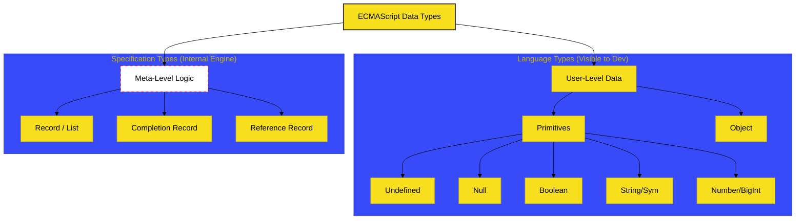

# SR-02: Types & Coercion Semantics

> **"Bahan Bakar & Sensor: Bagaimana Partikel Data Diidentifikasi, Dibentuk, dan Diproses oleh Reaktor Runtime."**

---

## 🔗 Source Hub
- **Primary Source**: [ECMA-262: Data Types and Values (Clause 6)](https://tc39.es/ecma262/#sec-ecmascript-data-types-and-values)
- **Technical Reference**: [ECMA-262: Type Conversion (Clause 7.1)](https://tc39.es/ecma262/#sec-type-conversion)

---

## 🌓 1. Essence: The Narrative

### Dual Definition
- **Formal**: Hierarki formal dari seluruh unit informasi yang dapat diproses oleh engine JavaScript. Mencakup **Language Types** (nilai yang dapat dimanipulasi oleh user) dan **Specification Types** (meta-data internal yang digunakan engine untuk mengelola status eksekusi).
- **Analogi**: Bayangkan **Partikel Atom** di dalam reaktor. Ada partikel yang bisa kita lihat dan pindahkan (Primitif & Objek), namun ada juga partikel sub-atomik (Reference, List, Records) yang hanya ada untuk menjaga stabilitas sirkuit reaktor agar tidak meledak (Error).

---

## 🗺️ 2. Visual Logic: The Data Hierarchy
Spesifikasi membagi dunia data menjadi dua domain utama:

---

## 🏛️ 3. Strategic Books (The Tracks)

1.  **[BK-01: Language Core Types](./BK-01_CoreTypes/)**
    *Bedah teknis Primitif dan infrastruktur dasar Objek.*
2.  **[BK-02: Numeric System](./BK-02_NumericSystem/)**
    *Presisi IEEE 754, BigInt, dan matematika spesifikasi.*
3.  **[BK-03: Specification Meta-Types](./BK-03_SpecMetaTypes/)**
    *Tipe data "gaib" spek: List, Record, & Reference Records.*

---

## 🧠 4. Under-the-hood: The Reference Record
Salah satu konsep terpenting di SR-02 adalah **Reference Record**. Ini bukan *Reference Type* biasa di bahasa lain, melainkan sebuah spesifikasi internal yang terdiri dari:
- `[[Base]]`: Tempat nilai berada (Environment Record atau Object).
- `[[ReferencedName]]`: Nama properti atau identifier.
- `[[Strict]]`: Flag mode ketat.

Inilah alasan mengapa `delete x` bisa gagal atau mengapa `this` bisa berubah nilainya tergantung bagaimana sebuah referensi dipanggil.

---
*Status: [/] Reconstruction in Progress. Mengacu pada Blueprint RAK-04.*
