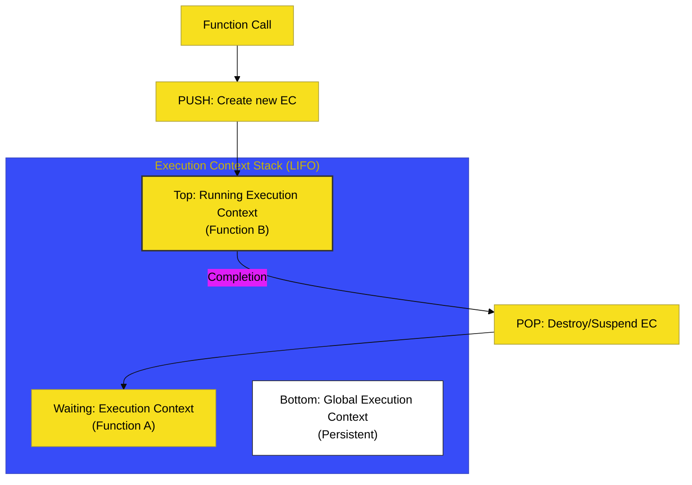

# BK-01: Execution Contexts

> **"Kotak Simulasi Reaktor: Membedah Lingkungan Terisolasi Mana Kode Dievaluasi dan Aliran Stack yang Mengaturnya."**

---

## 🌐 Source Hub
- **Strategic Blueprint**: [RAK-04 Core Specification](../README.md)
- **Primary Source**: [ECMA-262: Execution Contexts (Clause 9.4)](https://tc39.es/ecma262/#sec-execution-contexts)
- **Technical Reference**: [ECMA-262: The Execution Context Stack (Clause 9.4.1)](https://tc39.es/ecma262/#sec-execution-context-stack)

---

## 🌓 1. Essence: The Narrative

### Dual Definition
- **Formal**: Struktur data internal (spesifikasi) yang digunakan engine untuk melacak status eksekusi dari unit kode. Setiap konteks berisi status evaluasi (seperti program counter/PC), referensi ke **Realm**, dan **Environment Records** yang mengelola binding variabel.
- **Analogi**: Bayangkan sebuah **"Meja Kerja Teknisi"**. Setiap kali ada tugas baru (pemanggilan fungsi), teknisi akan menyiapkan meja kerja baru di atas meja sebelumnya. Meja ini memiliki alat ukurnya sendiri (**Environment Records**) dan dokumen referensi sendiri (**Realms**). Hanya meja paling atas yang aktif dikerjakan. Setelah tugas selesai, meja tersebut dibersihkan (Pop) dan meja di bawahnya kembali aktif.

---

## 🗺️ 2. Visual Logic: The Context Stack (LIFO)

Alur manajemen tumpukan eksekusi (LIFO - Last In, First Out):

---

## ⚙️ 3. Spec-Internals: Component Blueprint

Setiap **Execution Context** minimal memiliki komponen berikut menurut spesifikasi:

| Komponen | Deskripsi |
| :--- | :--- |
| **code evaluation state** | Melacak status eksekusi: di mana engine harus melanjutkan (PC). |
| **Function** | Objek fungsi yang sedang dievaluasi (null jika Global). |
| **Realm** | Akses ke sumber daya global (intrinsics) dan memori. |
| **ScriptOrModule** | Referensi ke script/module asal kode tersebut. |
| **LexicalEnvironment** | Digunakan untuk resolusi identifier (Scoping). |

---

## 🧪 4. The Lab: Discovery Specimens

Eksperimen kontrol tumpukan:
1.  **[examples/stack_recursion_lab.js](../../examples/stack_recursion_lab.js)**: Demonstrasi `Maximum call stack size exceeded`.
2.  **[examples/context_switching_perf.js](../../examples/context_switching_perf.js)**: Analisis biaya overhead pembuatan konteks fungsi besar.

---

## 🏛️ 5. Landscape: The Chapters

1.  **[CH-01: EC Architecture and State](./CH-01_ECArchitecture/)**
    *Bedah detail komponen internal konteks.*
2.  **[CH-02: Establishing Contexts](./CH-02_EstablishingContexts/)**
    *Mekanisme pembuatan konteks baru (Global vs Function vs Eval).*

---

## 🧠 6. Under-the-hood: The "Stack" Mechanics
Fakta fundamental: JavaScript bersifat **Single-threaded**, dan Call Stack inilah yang menjamin urutan eksekusi tetap deterministik. Saat fungsi `A` memanggil `B`, engine tidak "pindah" ke file lain secara acak, melainkan melakukan **Suspension** pada konteks `A` dan memindahkan fokus ke konteks `B`.

Hati-hati: Penumpukan konteks yang terlalu dalam (rekursi tanpa henti) akan menyebabkan ledakan memori pada stack, bukan heap, yang kita kenal sebagai *Stack Overflow*.

---
*Status: 🟢 Gold Standard | Kembali ke [SR-03](../README.md)*
