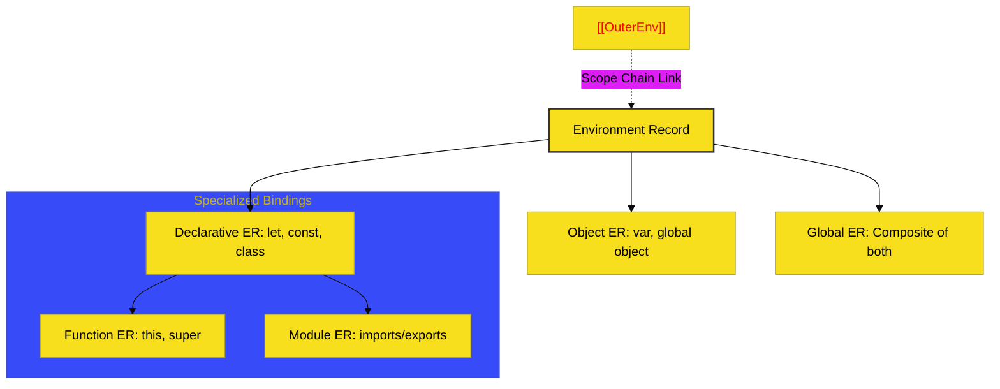

# BK-02: Environment Records

> **"Lemari Arsip Variabel: Struktur Memori yang Menjamin Keamanan dan Resolusi Binding di Setiap Lapis Scope."**

---

## 🌐 Source Hub
- **Strategic Blueprint**: [RAK-04 Core Specification](../README.md)
- **Primary Source**: [ECMA-262: Environment Records (Clause 9.1)](https://tc39.es/ecma262/#sec-environment-records)
- **Technical Reference**: [ECMA-262: Environment Record Hierarchy (Clause 9.1.1)](https://tc39.es/ecma262/#sec-the-environment-record-hierarchy)

---

## 🌓 1. Essence: The Narrative

### Dual Definition
- **Formal**: Objek internal spesifikasi yang bertindak sebagai "lemari penyimpanan" untuk binding identifier. Environment Records mengelola siklus hidup variabel (deklarasi, inisialisasi, akses) dan memiliki tautan rekursif ke lingkungan luar (**[[OuterEnv]]**) untuk membentuk rantai pencarian.
- **Analogi**: Bayangkan sebuah **"Kantor Bertingkat"**. Setiap ruangan di kantor tersebut adalah sebuah **Environment Record**. Jika Anda (Engine) mencari sebuah dokumen (Variabel) dan tidak menemukannya di ruangan Anda, Anda akan melangkah keluar ke koridor dan memeriksa ruangan di lantai yang sama atau lantai di atasnya (**Outer Link**) hingga Anda menemukannya di meja resepsionis pusat (**Global Environment**).

---

## 🗺️ 2. Visual Logic: The Environment Hierarchy

Jenis-jenis "Lemari Arsip" dalam spesifikasi:

---

## ⚙️ 3. Spec-Internals: Abstract Method Rules

Setiap **Environment Record** wajib mengimplementasikan metode internal berikut:

| Metode Internal | Deskripsi |
| :--- | :--- |
| **HasBinding(N)** | Mengecek apakah record memiliki binding untuk nama `N`. |
| **CreateMutableBinding(N, D)** | Membuat binding baru yang bisa diubah nilainya. |
| **CreateImmutableBinding(N, S)** | Membuat binding konstanta (const). |
| **InitializeBinding(N, V)** | Menetapkan nilai awal pada binding yang belum diinisialisasi. |
| **GetBindingValue(N, S)** | Mengambil nilai dari binding yang sudah ada. |

---

## 🧪 4. The Lab: Discovery Specimens

Eksperimen Lexical Scope:
1.  **[examples/lexical_scoping_lab.js](../../examples/lexical_scoping_lab.js)**: Demonstrasi Closure dan Outer Connection.
2.  **[examples/tdz_mechanics.js](../../examples/tdz_mechanics.js)**: Analisis *Temporal Dead Zone* pada Declarative Records.

---

## 🏛️ 5. Landscape: The Chapters

1.  **[CH-01: Environment Hierarchy](./CH-01_EnvironmentHierarchy/)**
    *Bedah teknis Declarative vs Object Records.*
2.  **[CH-02: Function Environments](./CH-02_FunctionEnvironments/)**
    *Pengelolaan binding khusus untuk `this`, `super`, dan mekanisme modul.*
3.  **[CH-03: The Outer Link Mechanic](./CH-03_TheOuterLink/)**
    *Bagaimana [[OuterEnv]] membangun jembatan antar-ruangan (Scope Chain).*

---

## 🧠 6. Under-the-hood: The "Outer Link" Mechanic
Di BK-02, kita membedah "Sihir" di balik **Closure**. Sebuah fungsi JavaScript tetap bisa mengakses variabel dari scope atasnya karena ia membawa referensi ke **Environment Record** tempat ia didefinisikan melalui internal slot **[[Environment]]**. 

Saat fungsi dieksekusi, engine membuat Environment Record baru dan menetapkan `[[OuterEnv]]`-nya ke slot tersebut. Inilah yang secara teknis menciptakan "Lantai Atas" dalam hierarki kantor kita, memungkinkan data tetap "hidup" selama ruangan tersebut masih memiliki akses kunci dari lantai bawah.

---
*Status: 🟢 Gold Standard | Kembali ke [SR-03](../README.md)*
