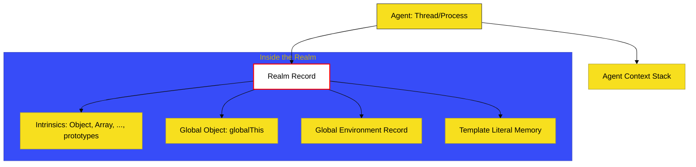

# BK-03: Realms and Agents

> **"Wilayah Kekuasaan & Penduduk: Unit Organisasi Tertinggi yang Memisahkan Ekosistem dan Mengelola Entitas Eksekusi."**

---

## 🌐 Source Hub
- **Strategic Blueprint**: [RAK-04 Core Specification](../README.md)
- **Primary Source**: [ECMA-262: Realms (Clause 9.3)](https://tc39.es/ecma262/#sec-code-realms)
- **Technical Reference**: [ECMA-262: Agents (Clause 9.7)](https://tc39.es/ecma262/#sec-agents)

---

## 🌓 1. Essence: The Narrative

### Dual Definition
- **Formal**: **Realm** adalah wadah isolasi sumber daya yang berisi set objek intrinsik (seperti `Object.prototype`, `Array`), objek global, dan lingkungan global. **Agent** adalah unit komputasi yang memiliki setidaknya satu Execution Context Stack dan mengelola Execution Realms.
- **Analogi**: Bayangkan sebuah **"Negara yang Berdaulat"**. **Realm** adalah negara tersebut, lengkap dengan perpustakaan nasional (**Intrinsics**) dan hukum dasar (**Global Environment**). Anda bisa memiliki banyak negara (seperti `iframe` atau `worker`), tetapi masing-masing memiliki "perpustakaan" dan "hukum" yang terpisah. **Agent** adalah birokrat yang menjalankan hukum di negara tersebut; ia hanya bisa mengerjakan satu kasus (Context) dalam satu waktu.

---

## 🗺️ 2. Visual Logic: The Infrastructure Map

Hierarki kepemilikan sumber daya di level engine:

---

## ⚙️ 3. Spec-Internals: The Realm Record

Setiap **Realm** direpresentasikan secara internal sebagai Record dengan bidang-bidang berikut:

| Field | Isi / Deskripsi |
| :--- | :--- |
| **[[Intrinsics]]** | Tabel objek bawaan standar (prefix `%` di spec). |
| **[[GlobalObject]]** | Objek yang menjadi puncak scope (window/global/self). |
| **[[GlobalEnv]]** | Environment record global yang mengelola binding global. |
| **[[TemplateMap]]** | Struktur data untuk caching template literal strings. |
| **[[HostDefined]]** | Informasi tambahan yang diberikan oleh host (Browser/Node). |

---

## 🧪 4. The Lab: Discovery Specimens

Eksperimen Isolasi Wilayah:
1.  **[examples/realm_isolation_verify.js](../../examples/realm_isolation_verify.js)**: Membuktikan ketidaksamaan intrinsik antar-iframe.
2.  **[examples/agent_concurrency_lab.js](../../examples/agent_concurrency_lab.js)**: Demonstrasi bagaimana Agent (Worker) tidak berbagi Stack.

---

## 🏛️ 5. Landscape: The Chapters

1.  **[CH-01: Execution Realms and Intrinsics](./CH-01_RealmsAndIntrinsics/)**
    *Bedah teknis isolasi wilayah dan daftar "buku sakti" (Intrinsics).*
2.  **[CH-02: Agents and Job Queues](./CH-02_AgentsAndJobs/)**
    *Pekerja engine, orkestrasi tugas mikro (Promises), dan batasan interaksi antar Agent.*

---

## 🧠 6. Under-the-hood: The "Intrinsics" Table
Misteri `instanceof` yang gagal: Di BK-03, kita membedah alasan mengapa `obj instanceof Object` bisa mengembalikan `false` jika `obj` berasal dari `iframe` lain. Secara teknis, setiap **Realm** memiliki tabel **Intrinsics** sendiri. 

Meskipun namanya sama-sama `Object`, referensi memorinya berbeda di setiap Realm. Inilah pondasi keamanan isolasi di web: satu tab tidak bisa merusak `Array.prototype` tab lain karena mereka berada di **Realms** yang berbeda secara spesifikasi, meskipun dieksekusi oleh mesin yang sama.

---
*Status: 🟢 Gold Standard | Kembali ke [SR-03](../README.md)*
