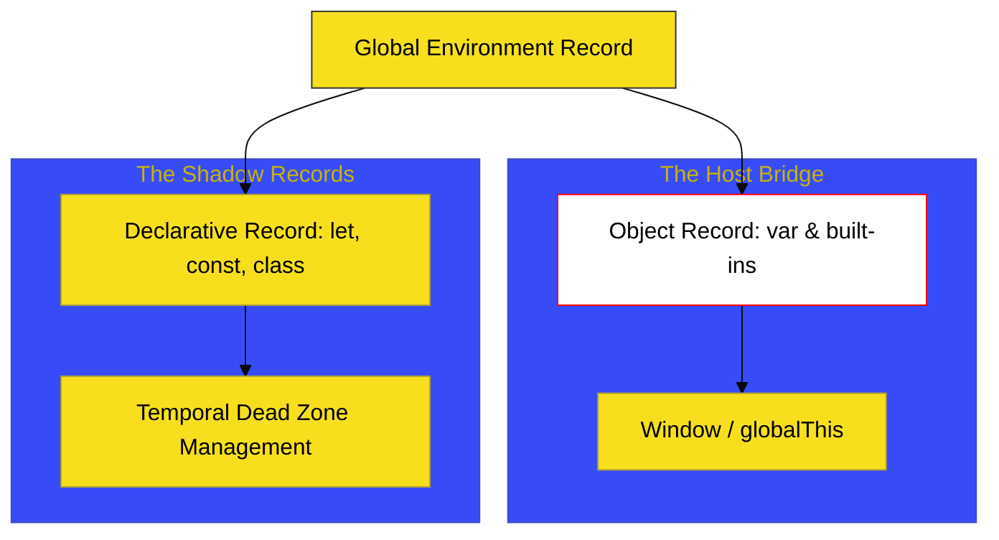

# BK-04: Scripts and Evaluation

> **"Pernyataan Publik: Membedah Evaluasi Kode Tradisional di Wilayah Terbuka Scope Global."**

---

## 🌐 Source Hub
- **Strategic Blueprint**: [RAK-04 Core Specification](../README.md)
- **Primary Source**: [ECMA-262: Scripts (Clause 15.1)](https://tc39.es/ecma262/#sec-scripts)
- **Technical Reference**: [ECMA-262: ScriptEvaluation (Clause 15.1.7)](https://tc39.es/ecma262/#sec-runtime-semantics-scriptevaluation)

---

## 🌓 1. Essence: The Narrative

### Dual Definition
- **Formal**: Struktur semantik yang mendefinisikan unit terkecil dari kode ECMAScript yang dapat dieksekusi secara mandiri dalam Global Environment. **Scripts** beroperasi tanpa isolasi modul, mendukung *Direct Global Binding* melalui Object Environment Record.
- **Analogi**: Bayangkan sebuah **"Papan Pengumuman Kota"**. Siapa pun bisa menempelkan memo (**var**) atau peraturan permanen (**let/const**) di sana. Papan ini bersifat terbuka; jika ada dua orang ingin memakai nama memo yang sama (`var`), papan ini mengizinkannya (Hoisting & Redeclaration), menciptakan lingkungan yang fleksibel namun berisiko konflik.

---

## 🗺️ 2. Visual Logic: Global Environment Dual-Anatomy

Struktur unik di balik "Papan Pengumuman" kita:

---

## ⚙️ 3. Spec-Internals: The Script Record

Engine memperlakukan script sebagai Record dengan komponen-komponen berikut:

| Bidang | Deskripsi |
| :--- | :--- |
| **[[Realm]]** | Realm tempat script ini dievaluasi. |
| **[[ECMAScriptCode]]** | Struktur AST (Abstract Syntax Tree) dari script tersebut. |
| **[[HostDefined]]** | Metadata yang disuntikkan host (Node.js/Browser). |

---

## 🧪 4. The Lab: Discovery Specimens

Eksperimen Evaluasi Script:
1.  **[examples/global_collision_lab.js](../../examples/global_collision_lab.js)**: Demonstrasi konflik antara Object Record and Declarative Record.
2.  **[examples/script_eval_perf.js](../../examples/script_eval_perf.js)**: Analisis kecepatan eksekusi script besar vs modul kecil.

---

## 🏛️ 5. Landscape: The Chapters

1.  **[CH-01: Script Evaluation](./CH-01_ScriptEval/)**
    *Mekanisme evaluasi serial dan jembatan ke lingkungan host.*
2.  **[CH-02: Open Circuits (The Sloppy Way)](./CH-02_OpenCircuits/)**
    *Bedah detail "Sloppy Mode" dan bahaya global implicit variables.*
3.  **[CH-03: Scope Boundaries](./CH-03_ScopeBoundaries/)**
    *Bagaimana engine memisahkan binding `let` dari objek global.*

---

## 🧠 6. Under-the-hood: The "Global" Split
Di BK-04, kita membedah alasan teknis mengapa `var x = 1` bisa diakses melalui `window.x`, sedangkan `let y = 2` tidak bisa. 

Hal ini disebabkan karena **Global Environment Record** secara unik menggabungkan dua jenis "lemari": **Object Record** (yang menempel pada objek global) dan **Declarative Record** (yang terisolasi di memori internal). Pemahaman ini adalah kunci bagi arsitek untuk mengelola polusi scope global dan memahami cara kerja "Sloppy Mode" vs "Strict Mode" di level mesin paling bawah.

---
*Status: 🟢 Gold Standard | Kembali ke [SR-03](../README.md)*
