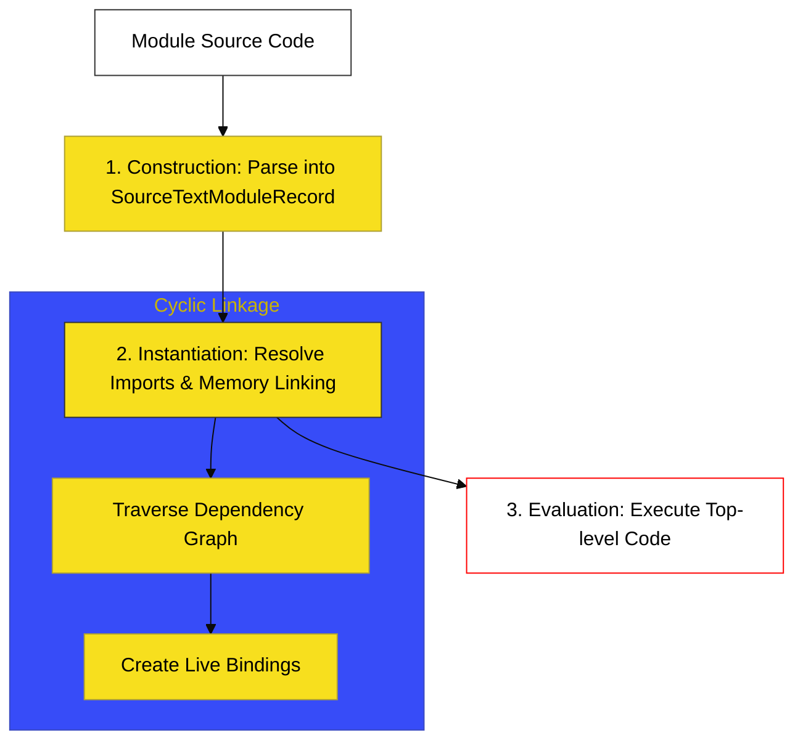

# BK-05: Modules and Binding

> **"Sistem Kedutaan Besar: Membedah Arsitektur Isolasi dan Protokol Komunikasi Formal Antar Unit Kode Terpisah."**

---

## 🌐 Source Hub
- **Strategic Blueprint**: [RAK-04 Core Specification](../README.md)
- **Primary Source**: [ECMA-262: Modules (Clause 15.2)](https://tc39.es/ecma262/#sec-modules)
- **Technical Reference**: [ECMA-262: Module Records (Clause 15.2.1)](https://tc39.es/ecma262/#sec-abstract-module-records)

---

## 🌓 1. Essence: The Narrative

### Dual Definition
- **Formal**: Struktur semantik yang mendefinisikan unit terkecil dari kode ECMAScript yang beroperasi dalam lingkup modul (Module Scoping), ditandai dengan sifat asinkron, *strict mode* otomatis, dan mekanisme **Live Bindings** melalui **Cyclic Module Records**.
- **Analogi**: Bayangkan sebuah **"Jaringan Kedutaan Besar"**. Setiap modul adalah gedung kedutaan yang memiliki yurisdiksi sendiri (Scope). Tidak ada agen luar yang bisa melihat apa yang terjadi di dalam gedung tersebut kecuali melalui pintu ekspor-impor resmi. Menariknya, jalur komunikasi antar kedutaan bersifat **"Live Link"**; jika kedutaan pusat merubah dokumen kebijakan, dokumen tersebut akan berubah seketika di semua kedutaan cabang yang memilikinya.

---

## 🗺️ 2. Visual Logic: The Module Lifecycle

Tiga fase sakral sebelum kode modul dijalankan:

---

## ⚙️ 3. Spec-Internals: Cyclic Module Record

Engine mengelola dependensi modul menggunakan struktur data **Cyclic Module Record**:

| Bidang Internal | Fungsi / Peran |
| :--- | :--- |
| **[[Status]]** | Status modul: `unlinked`, `linking`, `linked`, `evaluating`, `evaluated`. |
| **[[DFSIndex]]** | Indeks kunjungan untuk algoritma rekursif Graph (Depth First Search). |
| **[[RequestedModules]]** | Daftar file yang dibutuhkan oleh modul ini (impor). |
| **[[ImportEntries]]** | Detail binding spesifik: apa yang diimpor dan dari mana. |
| **[[ExportEntries]]** | Detail binding spesifik: apa yang diekspos keluar. |

---

## 🧪 4. The Lab: Discovery Specimens

Eksperimen Mekanisme Modul:
1.  **[examples/live_binding_lab.mjs](../../examples/live_binding_lab.mjs)**: Membuktikan sinkronisasi nilai otomatis antar-modul.
2.  **[examples/cyclic_dependency_fix.mjs](../../examples/cyclic_dependency_fix.mjs)**: Teknik menangani modul yang saling membutuhkan.

---

## 🏛️ 5. Landscape: The Chapters

1.  **[CH-01: Module Records and Linkage](./CH-01_ModuleLinkage/)**
    *Bedah teknis `Cyclic Module Record` dan rantaian dependensi.*
2.  **[CH-02: Module Records (Identity)](./CH-02_ModuleRecords/)**
    *Mendefinisikan identitas modul di level spesifikasi.*
3.  **[CH-03: Reinforced Cables (Live Bindings)](./CH-03_ReinforcedCables/)**
    *Mekanisme Impor/Ekspor dan perilaku objek Namespace Modul.*

---

## 🧠 6. Under-the-hood: The "Live Binding" Secret
Di BK-05, kita mempelajari salah satu perbedaan tersulit antara modul gaya lama (CommonJS) dan ESM modern: **Live Bindings**. 

Di ES Modules, saat Anda mengimpor sebuah nilai, Anda sebenarnya mengimpor referensi memori (binding), bukan salinan nilai (copy). Jika modul yang dieksport mengubah nilai tersebut, nilai di modul pengimpor akan ikut berubah secara otomatis. Namun, sebagai pengimpor, Anda memiliki **Immutable Binding**—Anda bisa membacanya, tapi dilarang keras mengubahnya dari pihak pengimpor.

---
*Status: 🟢 Gold Standard | Kembali ke [SR-03](../README.md)*
