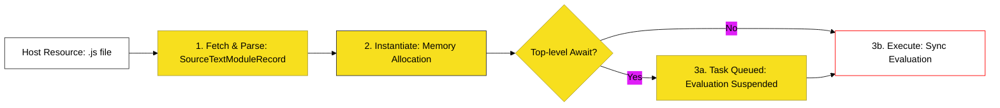

# BK-06: Loading and Transmission

> **"Pipeline Pengolahan Logistik: Membedah Alur Transformasi Kargo Teks Mentah Menjadi Aliran Energi Runtime."**

---

## 🌐 Source Hub
- **Strategic Blueprint**: [RAK-04 Core Specification](../README.md)
- **Primary Source**: [ECMA-262: Module Loading (Clause 16.2)](https://tc39.es/ecma262/#sec-modules-loading)
- **Technical Reference**: [ECMA-262: Host Hooks (Clause 16.1.10)](https://tc39.es/ecma262/#sec-hostimportmoduledynamically)

---

## 🌓 1. Essence: The Narrative

### Dual Definition
- **Formal**: Protokol operasional spesifikasi yang mengatur bagaimana engine berinteraksi dengan **Host** (Browser/Node) untuk mengambil sumber daya modul dan mengevaluasinya melalui pipeline tiga tahap: **Construction**, **Instantiation**, dan **Evaluation**.
- **Analogi**: Bayangkan sebuah **"Pusat Distribusi Logistik"**. Proses dimulai dengan pemesanan barang (**Load/Fetch**). Saat barang tiba, ia harus didata kemasannya (**Parse**), dicocokkan dengan manifes gudang (**Link/Bind**), dan barulah setelah semua beres, kargo dibuka dan isinya didistribusikan ke rak-rak toko (**Evaluation**). Jika satu kargo tertahan karena pemeriksaan keamanan (**Top-level Await**), seluruh pipeline pengiriman di jalur tersebut akan ikut tertunda secara sinkron.

---

## 🗺️ 2. Visual Logic: The Evaluation Pipeline

Bagaimana kargo kode bermutasi di sepanjang jalur transmisi:

---

## ⚙️ 3. Spec-Internals: The Host Hooks

Engine tidak bisa melakukan I/O sendiri; ia bergantung pada **Host Hooks** untuk menjembatani dunia spesifikasi dengan dunia luar:

| Host Hook | Fungsi / Tanggung Jawab |
| :--- | :--- |
| **HostImportModuleDynamically** | Dicuat saat `import()` dipanggil untuk memuat modul secara malas (lazy). |
| **HostGetImportMetaProperties** | Menyediakan metadata modul (seperti `import.meta.url`). |
| **HostResolveImportedModule** | Menentukan lokasi file fisik berdasarkan string "specifier". |
| **FinishDynamicImport** | Hook untuk menyelesaikan janji (Promise) dari impor dinamis. |

---

## 🧪 4. The Lab: Discovery Specimens

Eksperimen Pipeline Transmisi:
1.  **[examples/dynamic_import_lab.js](../../examples/dynamic_import_lab.js)**: Demonstrasi Hook `import()` dan pemuatan asinkron.
2.  **[examples/top_level_await_flow.mjs](../../examples/top_level_await_flow.mjs)**: Analisis urutan eksekusi pada modul tersuspensi.

---

## 🏛️ 5. Landscape: The Chapters

1.  **[CH-01: Parsing Phase and Construction](./CH-01_ParsingPhase/)**
    *Infrastruktur pembentukan `SourceTextModuleRecord` dan pengaitan host.*
2.  **[CH-02: Evaluation Phase and Top-level Await](./CH-02_EvaluationPhase/)**
    *Mekanisme evaluasi akhir dan manajemen sinkronisasi asinkron.*
3.  **[CH-03: Static Routing (The Import Map)](./CH-03_StaticRouting/)**
    *Bagaimana host menentukan resolusi statis sebelum eksekusi.*
4.  **[CH-04: Dynamic Routing (The Orchestrator)](./CH-04_DynamicRouting/)**
    *Orkestrasi pemuatan runtime yang fleksibel.*

---

## 🧠 6. Under-the-hood: The "Host Hook" Mechanism
Di BK-06, kita mempelajari bahwa spesifikasi ECMA-262 sebenarnya tidak tahu "cara men-download file". Hal tersebut adalah tanggung jawab **Host Environment** (seperti browser). 

Engine hanya menyediakan **Hooks** (seperti `HostImportModuleDynamically`) yang merupakan pintu gerbang di mana spesifikasi memberikan instruksi kepada host: "Saya butuh file di URL ini, tolong beritahu saya jika sudah siap." Memahami pemisahan tanggung jawab antara Engine dangan Host adalah kunci untuk menjadi arsitek yang mampu mengoptimalkan performa pemuatan aplikasi skala besar.

---
*Status: 🟢 Gold Standard | Kembali ke [SR-03](../README.md)*
