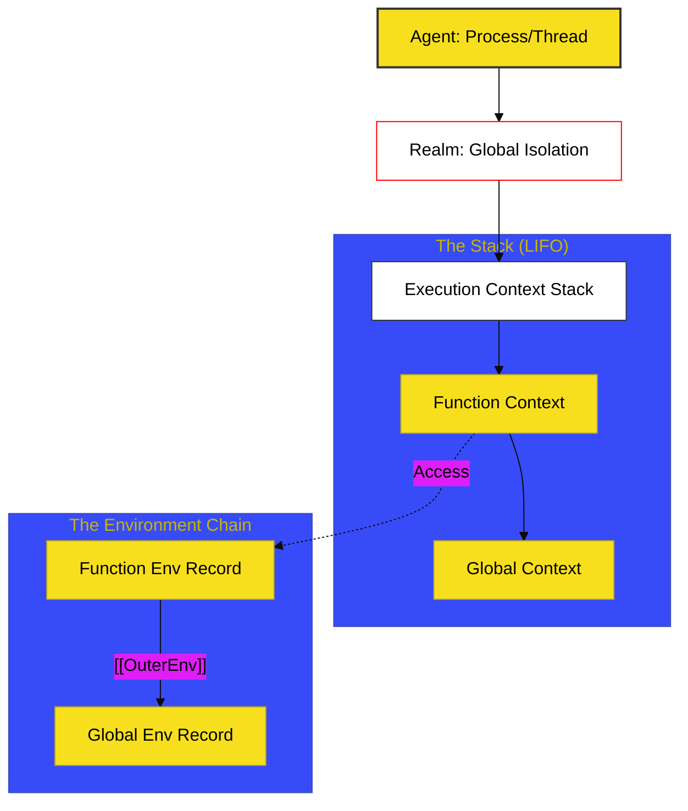

# SR-03: Execution Context & Realm Orchestration

> **"Sistem Manajemen Gedung & Listrik: Bagaimana Setiap Ruangan (Context) Mendapatkan Daya (Scope) dan Terhubung Secara Modular."**

---

## 🔗 Source Hub
- **Primary Source**: [ECMA-262: Executable Code and Execution Contexts (Clause 9)](https://tc39.es/ecma262/#sec-executable-code-and-execution-contexts)
- **Technical Reference**: [ECMA-262: Scripts and Modules (Clause 16)](https://tc39.es/ecma262/#sec-ecmascript-language-scripts-and-modules)

---

## 🌓 1. Essence: The Narrative

### Dual Definition
- **Formal**: Infrastruktur runtime yang mengelola siklus hidup kode yang sedang berjalan melalui **Execution Context Stack**, pelacakan variabel via **Environment Records**, serta isolasi memori dan globals melalui **Realms** dan **Agents**.
- **Analogi**: Bayangkan sebuah **Gedung Perkantoran Raksasa** (Agent). Setiap lantai adalah sebuah **Realm** dengan fasilitas mandiri. Di dalam setiap lantai, ada banyak ruangan rapat (**Execution Context**) yang muncul dan menghilang (Stack). Setiap ruangan memiliki stopkontak dan akses dokumen (**Environment Record**) yang bisa merujuk ke dokumen di luar ruangan (Scope Chain).

---

## 🗺️ 2. Visual Logic: The Runtime Architecture
Mekanisme runtime JavaScript bekerja dalam struktur berlapis:

---

## 🏛️ 3. Strategic Books (The Tracks)

1.  **[BK-01: Execution Contexts](./BK-01_ExecutionContexts/)**
    *Infrastruktur Call Stack, LIFO, dan lifecycle konteks.*
2.  **[BK-02: Environment Records](./BK-02_EnvironmentRecords/)**
    *Mekanisme identifier resolution, Hoisting, dan Outer Link.*
3.  **[BK-03: Realms & Agents](./BK-03_RealmsAndAgents/)**
    *Isolasi Global Intrinsics dan penjadwalan unit komputasi.*
4.  **[BK-04: Scripts & Evaluation](./BK-04_ScriptsEvaluation/)**
    *Mekanika pemuatan script tradisional dan legacy execution.*
5.  **[BK-05: Modules & Binding](./BK-05_ModulesBinding/)**
    *Module Records, Live Bindings, dan integrasi ESM.*
6.  **[BK-06: Loading & Transmission](./BK-06_LoadingTransmission/)**
    *Protokol transmisi: Parsing, Instantiation, dan Evaluation.*

---

## 🧠 4. Under-the-hood: The "Real" Lexical Scope
Di SR-03, kita membedah bahwa "Scope" bukanlah sekadar konsep abstrak, melainkan struktur data fisik yang disebut **Environment Record**. Setiap kali fungsi dipanggil, engine membuat record baru yang memiliki pointer `[[OuterEnv]]` ke record sebelumnya. Inilah yang secara teknis membangun "Scope Chain" dan memungkinkan terjadinya **Closure**.

Tanpa SR-03, pemahaman tentang "Hoisting" atau "Memory Leaks via Closure" hanya akan sebatas tebakan. Di sini, kita melihat kabel-kabel fisik yang menghubungkannya.

---
*Status: [/] Reconstruction in Progress. Mengacu pada Blueprint RAK-04.*
