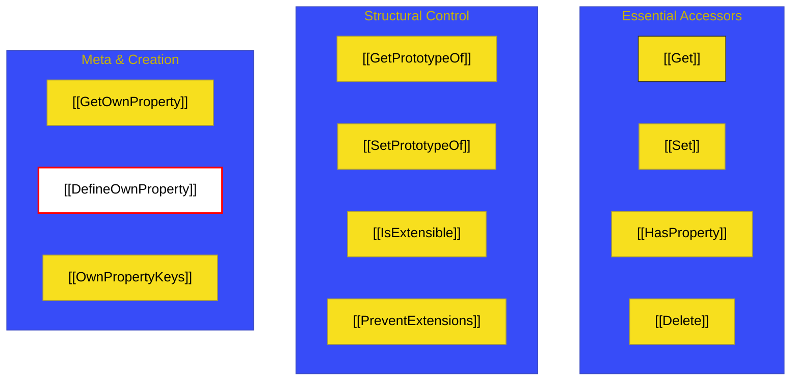

# BK-01: Object Internal Methods

> **"Robot Servis Internal: Membedah Mekanika Tersembunyi yang Menggerakkan Respon Objek terhadap Operasi Kode."**

---

## 🌐 Source Hub
- **Strategic Blueprint**: [RAK-04 Core Specification](../README.md)
- **Primary Source**: [ECMA-262: Object Internal Methods (Clause 6.1.7)](https://tc39.es/ecma262/#sec-object-internal-methods-and-internal-slots)
- **Technical Reference**: [ECMA-262: Essential Internal Methods (Clause 10.1)](https://tc39.es/ecma262/#sec-essential-internal-methods-of-objects)

---

## 🌓 1. Essence: The Narrative

### Dual Definition
- **Formal**: Perilaku operasional di level implementasi engine yang diekspresikan melalui sekumpulan **metode internal** (ditandai dengan `[[...]]`). Setiap objek ECMAScript harus mengimplementasikan setidaknya 14 metode internal esensial untuk menjamin konsistensi sirkuit data.
- **Analogi**: Bayangkan sebuah **"Modul Perangkat Keras"**. Anda melihat casing luarnya (Objek). Saat Anda menyentuh tombol tertentu (akses properti), ada **Robot Servis Internal** yang bergerak di dalam casing tersebut untuk mengambil informasi (**[[Get]]**) atau merubah memori internalnya (**[[Set]]**). Anda tidak bisa melihat robot itu secara langsung, tapi Anda bisa merasakan hasilnya melalui data yang dikembalikan kepada Anda.

---

## 🗺️ 2. Visual Logic: The Internal Method Map

14 instruksi dasar yang wajib dimiliki oleh setiap **Ordinary Object**:

---

## ⚙️ 3. Spec-Internals: Essential Internal Methods

Berikut adalah tabel instruksi sakral yang mengontrol objek dasar (Ordinary Objects):

| Metode Internal | Deskripsi Semantik |
| :--- | :--- |
| **[[Get]]** | Mengambil nilai properti. |
| **[[Set]]** | Menetapkan/Merubah nilai properti. |
| **[[HasProperty]]** | Mengecek keberadaan properti (operator `in`). |
| **[[Delete]]** | Menghapus properti dari objek. |
| **[[DefineOwnProperty]]** | Membuat/Merubah deskriptor properti. |
| **[[GetPrototypeOf]]** | Mengambil tautan ke objek prototipe. |

---

## 🧪 4. The Lab: Discovery Specimens

Eksperimen Mekanika Objek:
1.  **[examples/internal_getter_setter.js](../../examples/internal_getter_setter.js)**: Demonstrasi bagaimana `[[Get]]` memicu fungsi akses.
2.  **[examples/object_freeze_mechanics.js](../../examples/object_freeze_mechanics.js)**: Analisis kegagalan `[[DefineOwnProperty]]` pada objek beku.

---

## 🏛️ 5. Landscape: The Chapters

1.  **[CH-01: Object Internal Methods](./CH-01_InternalMechanics/)**
    *Bedah teknis 14 metode esensial dan manajemen slot internal.*
2.  **[CH-02: Method Invariants & Slots](./CH-02_InternalSlots/)**
    *Aturan sakral yang tidak boleh dilanggar oleh engine dan pengelolaan slot memori.*

---

## 🧠 6. Under-the-hood: Slots vs Attributes
Di BK-01, kita membedah perbedaan sakral antara **Property Attributes** (seperti `value`, `writable`) yang bisa dimodifikasi melalui `Object.defineProperty`, dan **Internal Slots** (seperti `[[Prototype]]`, `[[Extensible]]`) yang hanya bisa dimanipulasi melalui metode internal spesifik. 

Memahami BK-01 akan memberikan Anda kearifan untuk memprediksi kapan sebuah objek akan "berontak" (melemparkan error) saat Anda mencoba mengubah strukturnya, terutama pada objek yang telah dikunci (**Sealed/Frozen Objects**) yang melibatkan manipulasi slot internal `[[Extensible]]`.

---
*Status: 🟢 Gold Standard | Kembali ke [SR-04](../README.md)*
