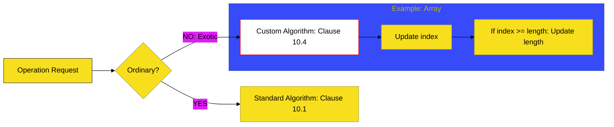

# BK-03: Exotic Object Behaviors

> **"Beton Khusus & Sensor Kustom: Membedah Unit-unit yang Melampaui Batas Standar Melalui Modifikasi Metode Internal."**

---

## 🌐 Source Hub
- **Strategic Blueprint**: [RAK-04 Core Specification](../README.md)
- **Primary Source**: [ECMA-262: Exotic Objects (Clause 10.4)](https://tc39.es/ecma262/#sec-built-in-exotic-object-internal-methods-and-slots)
- **Technical Reference**: [ECMA-262: Array Exotic Objects (Clause 10.4.2)](https://tc39.es/ecma262/#sec-array-exotic-objects)

---

## 🌓 1. Essence: The Narrative

### Dual Definition
- **Formal**: Objek-objek yang "melanggar" satu atau lebih perilaku default (**Ordinary**) dengan menyediakan implementasi kustom pada metode internal esensialnya. Tipe utama mencakup **Array** (automasi panjang), **Proxy** (intersepsi total), dan **String** (indeks imutabel).
- **Analogi**: Bayangkan sebuah **"Pabrik Komponen"**. Kebanyakan barang yang keluar adalah komponen standar (**Ordinary Object**). Namun, ada beberapa komponen khusus yang memiliki "sirkuit pintar" di dalamnya: sebuah kotak yang meregang sendiri saat diisi (**Array**), atau sebuah bayangan yang tidak memiliki isi namun bisa melakukan apa pun yang diperintahkan oleh aslinya (**Proxy**).

---

## 🗺️ 2. Visual Logic: The Exotic Matrix

Mengapa mereka disebut "Eksotis" di level spesifikasi:

| Object Type | Custom Method | Magic Behavior |
| :--- | :---: | :--- |
| **Array** | `[[DefineOwnProperty]]` | Sinkronisasi properti `length` otomatis. |
| **String** | `[[GetOwnProperty]]` | Mengunci akses karakter melalui indeks numerik. |
| **Proxy** | ALL Methods | Mengalihkan (trap) operasi ke objek handler. |
| **Bound Function** | `[[Call]]` / `[[Construct]]` | Penguncian konteks `this` secara permanen. |

---

## ⚙️ 3. Spec-Internals: Exotic Record Traits

Objek eksotis memiliki slot internal tambahan untuk mendukung logika "sihir" mereka:

| Object Type | Internal Slots | Fungsi Utama |
| :--- | :--- | :--- |
| **Proxy** | `[[ProxyHandler]]`, `[[ProxyTarget]]` | Menyimpan target dan objek pemroses (trap). |
| **Bound Function** | `[[BoundTargetFunction]]`, `[[BoundThis]]` | Mengikat fungsi asli dan konteks `this`. |
| **TypedArray** | `[[ViewedArrayBuffer]]`, `[[ByteLength]]` | Akses langsung ke memori biner mentah. |

---

## 🧪 4. The Lab: Discovery Specimens

Eksperimen Objek Eksotis:
1.  **[examples/proxy_trap_lab.js](../../examples/proxy_trap_lab.js)**: Demonstrasi intersepsi `[[Get]]` dan `[[Set]]` secara total.
2.  **[examples/array_length_magic.js](../../examples/array_length_magic.js)**: Bukti bahwa `length` bukan sekadar angka biasa.

---

## 🏛️ 5. Landscape: The Chapters

1.  **[CH-01: Array and String Exotics](./CH-01_ArrayStringExotics/)**
    *Bedah teknis sirkuit `length` dan indeks memori string.*
2.  **[CH-02: Bound Functions and Proxy Exotics](./CH-02_BoundProxyExotics/)**
    *Mekanisme intersepsi dan penguncian konteks.*
3.  **[CH-03: String Exotics (Legacy Indexting)](./CH-03_StringExotics/)**
    *Isolasi karakter melalui [[GetOwnProperty]].*
4.  **[CH-04: Proxy Exotics (The Full Interceptor)](./CH-04_ProxyExotics/)**
    *Bagaimana Proxy mengalihkan semua metode internal.*
5.  **[CH-05: Array Exotic Behavior (Length Magic)](./CH-05_ArrayExoticBehavior/)**
    *Mekanisme reset dan sinkronisasi kapasitas.*

---

## 🧠 6. Under-the-hood: The Array Length "Magic"
Di BK-03, kita mempelajari fakta bahwa **Array `length` bukanlah properti biasa**. Secara internal, setiap kali Anda memodifikasi indeks numerik pada array, metode internal **`[[DefineOwnProperty]]`** pada Array Exotic Object akan memicu langkah pengecekan tambahan untuk memperbarui `length`. 

Inilah alasan mengapa Anda bisa menghapus isi array hanya dengan mengetik `arr.length = 0`. Ini bukan "syntax sugar" di level bahasa, melainkan instruksi sirkuit yang sangat dalam di level spesifikasi yang memanipulasi slot internal objek tersebut.

---
*Status: 🟢 Gold Standard | Kembali ke [SR-04](../README.md)*
