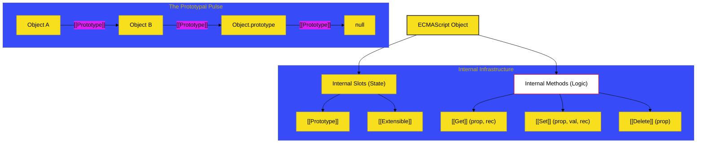

# SR-04: Object & Prototype Mechanics

> **"Anatomi & DNA: Bagaimana Setiap Sel (Objek) Memiliki Instruksi Genetik Internal yang Menentukan Perilaku dan Warisannya."**

---

## 🔗 Source Hub
- **Primary Source**: [ECMA-262: Ordinary and Exotic Objects (Clause 10)](https://tc39.es/ecma262/#sec-ordinary-and-exotic-objects-behaviors)
- **Technical Reference**: [ECMA-262: Prototype Chain Operations (Clause 10.1.1)](https://tc39.es/ecma262/#sec-ordinary-object-internal-methods-and-internal-slots)

---

## 🌓 1. Essence: The Narrative

### Dual Definition
- **Formal**: Spesifikasi perilaku internal objek melalui **Internal Slots** (penampung data non-visible) dan **Internal Methods** (algoritma internal untuk akses properti). Hub ini membedakan mekanisme antara **Ordinary Objects** (objek standar) dan **Exotic Objects** (objek dengan perilaku menyimpang seperti Array, Proxy, dan String).
- **Analogi**: Pikirkan sebuah **Organisme (Objek)**. Setiap organisme memiliki organ internal (**Internal Slots**) yang tidak terlihat dari luar tapi menentukan fungsinya. Ketika Anda menyentuh permukaan organisme tersebut (akses properti), ia bereaksi berdasarkan serangkaian refleks internal (**Internal Methods**). Dan melalui DNA-nya (**Prototype**), ia mewarisi kemampuan dari leluhurnya secara otomatis.

---

## 🗺️ 2. Visual Logic: The Object Anatomy
Struktur internal objek yang menggerakkan seluruh ekosistem JavaScript:

---

## 🏛️ 3. Strategic Books (The Tracks)

1.  **[BK-01: Internal Methods](./BK-01_InternalMethods/)**
    *14 metode internal sakral dan Invarian integritas objek.*
2.  **[BK-02: Exotic Behaviors](./BK-02_ExoticBehaviors/)**
    *Bedah teknis Array, String, Proxy, dan Bound Function exotics.*
3.  **[BK-03: Function Mechanics](./BK-03_FunctionMechanics/)**
    *Slot internal `[[Call]]` dan `[[Construct]]` yang menghidupkan fungsi.*

---

## 🧠 4. Under-the-hood: The 14 Sacred Methods
Di SR-04, kita belajar bahwa tidak ada properti yang "benar-benar" diakses secara langsung. Setiap `obj.prop` sebenarnya memanggil internal method `[[Get]]`. Spesifikasi ECMA-262 mendefinisikan **14 metode internal** esensial yang harus dimiliki oleh setiap objek agar dianggap valid. 

Memahami metode ini adalah kunci untuk menguasai **Proxy API**. Karena Proxy hanyalah cara untuk mencegat (intercept) 14 metode sakral ini dan menggantinya dengan logika kustom Anda sendiri.

---
*Status: [/] Reconstruction in Progress. Mengacu pada Blueprint RAK-04.*
