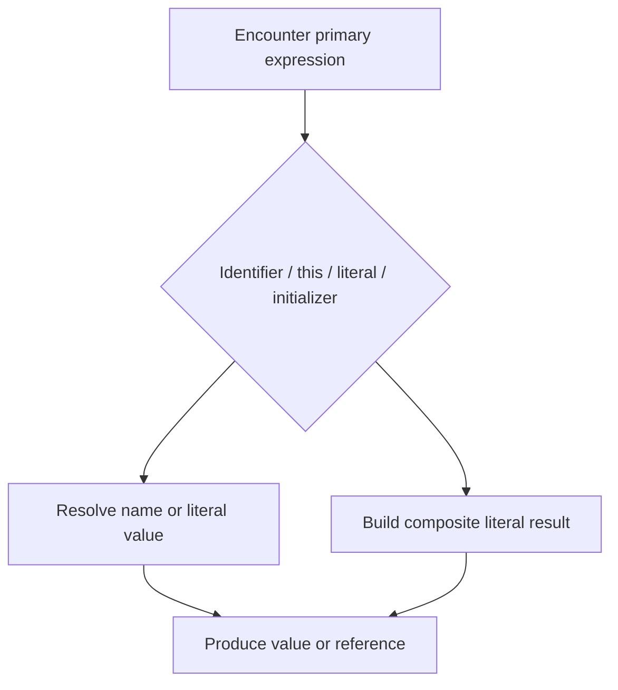

# CH-01: Primary Units

> **"Primary expressions membentuk nilai dasar sebelum operator lain mulai memprosesnya."**

**Source Hub**:
- [ECMA-262: Primary Expressions](https://tc39.es/ecma262/#sec-primary-expressions)

---

## Mekanisme Inti

---

## Fokus Audit
1. Identifier reference dan literal value tidak melalui jalur evaluasi yang sama.
2. `this` adalah primary expression yang nilainya datang dari execution context.
3. Initializer menghasilkan struktur nilai melalui langkah pembentukan internal, bukan sekadar teks literal.

---

## Lab Praktis

Buka file `examples/01_primary_units_lab.js` untuk membandingkan resolusi identifier, `this`, dan object initializer dalam satu alur pendek.

---
*Status: [x] Complete | [status.md](../../../docs/status.md)*
