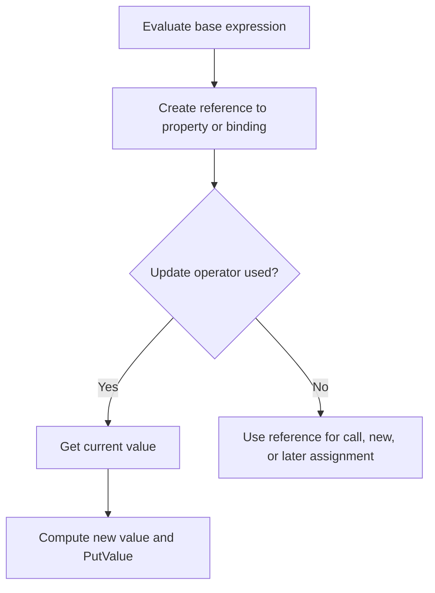

# CH-02: LHS and Update

> **"Left-hand-side expressions menemukan target reference, lalu update operators memodifikasi nilai pada target itu."**

**Source Hub**:
- [ECMA-262: Left-Hand-Side Expressions](https://tc39.es/ecma262/#sec-left-hand-side-expressions)
- [ECMA-262: Update Expressions](https://tc39.es/ecma262/#sec-update-expressions)

---

## Mekanisme Inti

---

## Fokus Audit
1. LHS expressions penting karena mereka menghasilkan reference, bukan sekadar nilai akhir.
2. `++` dan `--` selalu melalui siklus read-compute-write.
3. Optional chaining mengubah traversal reference dengan short exit saat basisnya nullish.

---

## Lab Praktis

Buka file `examples/01_lhs_update_lab.js` untuk melihat reference property, optional chaining, dan postfix update pada satu objek yang sama.

---
*Status: [x] Complete | [status.md](../../../docs/status.md)*
