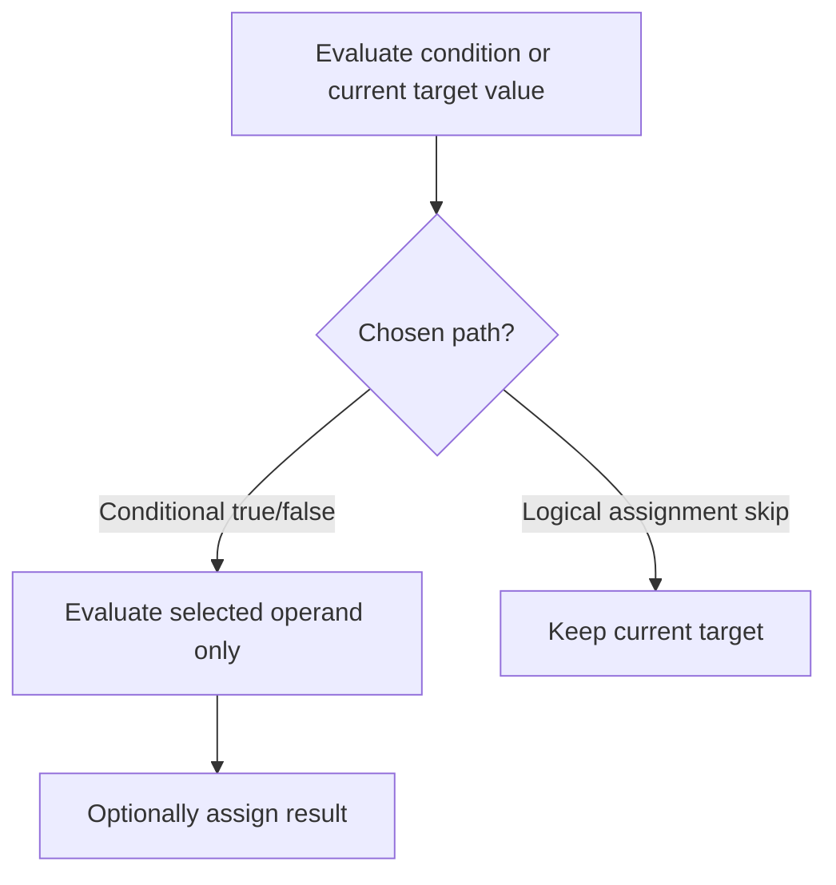

# CH-01: Conditional Assignment

> **"Conditional operator dan logical assignment memilih jalur evaluasi lalu memutuskan apakah assignment perlu terjadi."**

**Source Hub**:
- [ECMA-262: Conditional Operator](https://tc39.es/ecma262/#sec-conditional-operator)
- [ECMA-262: Assignment Operators](https://tc39.es/ecma262/#sec-assignment-operators)

---

## Mekanisme Inti

---

## Fokus Audit
1. Ternary hanya mengevaluasi satu cabang hasil.
2. `&&=`, `||=`, dan `??=` menggabungkan jalur logika dengan potensi write-back ke target.
3. Logical assignment perlu dibaca sebagai optimasi evaluasi plus assignment semantics.

---

## Lab Praktis

Buka file `examples/01_conditional_assignment_lab.js` untuk membandingkan ternary, `||=`, dan `??=` pada beberapa target awal.

---
*Status: [x] Complete | [status.md](../../../docs/status.md)*
