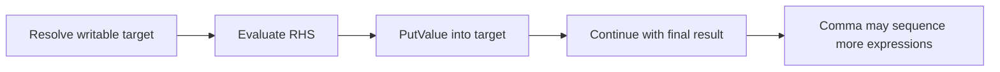

# CH-02: Assignment and Comma

> **"Assignment menyimpan hasil ke target reference, sementara comma operator mengurutkan evaluasi dan mengembalikan operand terakhir."**

**Source Hub**:
- [ECMA-262: Assignment Operators](https://tc39.es/ecma262/#sec-assignment-operators)
- [ECMA-262: Comma Operator](https://tc39.es/ecma262/#sec-comma-operator)

---

## Mekanisme Inti

---

## Fokus Audit
1. Assignment butuh target yang bisa ditulis, bukan sekadar value biasa.
2. Compound assignment membaca nilai lama sebelum menulis hasil baru.
3. Comma operator mengembalikan operand terakhir setelah semua operand sebelumnya dievaluasi.

---

## Lab Praktis

Buka file `examples/01_assignment_comma_lab.js` untuk melihat assignment biasa, compound assignment, destructuring, dan comma sequencing.

---
*Status: [x] Complete | [status.md](../../../docs/status.md)*
