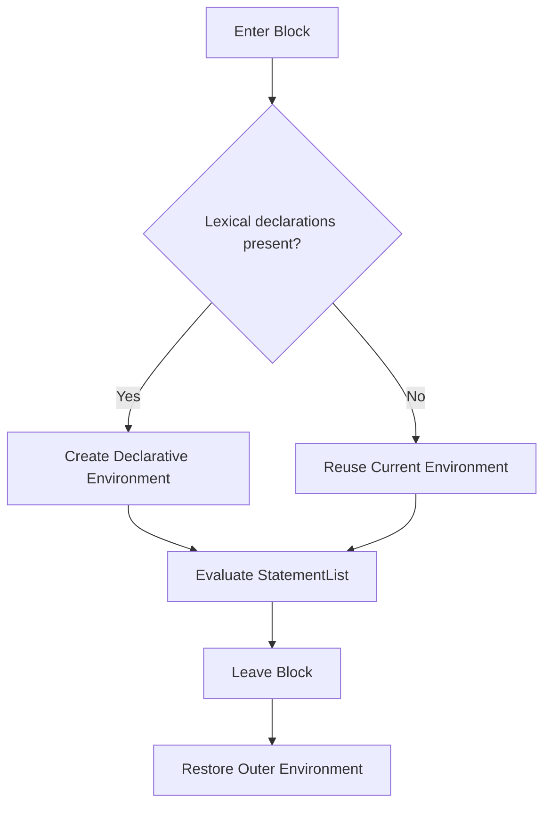

# CH-01: Blocks and Scope

> **"Blok adalah batas lokal tempat binding leksikal lahir, hidup, dan dipulihkan."**

**Source Hub**:
- [ECMA-262: Block](https://tc39.es/ecma262/#sec-block)
- [ECMA-262: BlockDeclarationInstantiation](https://tc39.es/ecma262/#sec-blockdeclarationinstantiation)

---

## Mekanisme Inti

---

## Fokus Audit
1. `let`, `const`, dan `class` hidup pada lexical environment milik blok.
2. `var` tidak memakai batas blok, sehingga perilakunya harus dibaca lewat variable environment yang lebih luar.
3. TDZ bukan fitur kosmetik, tetapi konsekuensi dari binding yang sudah didaftarkan namun belum diinisialisasi.

---

## Lab Praktis

Buka file `examples/01_block_scope_lab.js` untuk membandingkan binding `var` dan `let` saat blok masuk dan keluar dari cakupan aktif.

---
*Status: [x] Complete | [status.md](../../../docs/status.md)*
