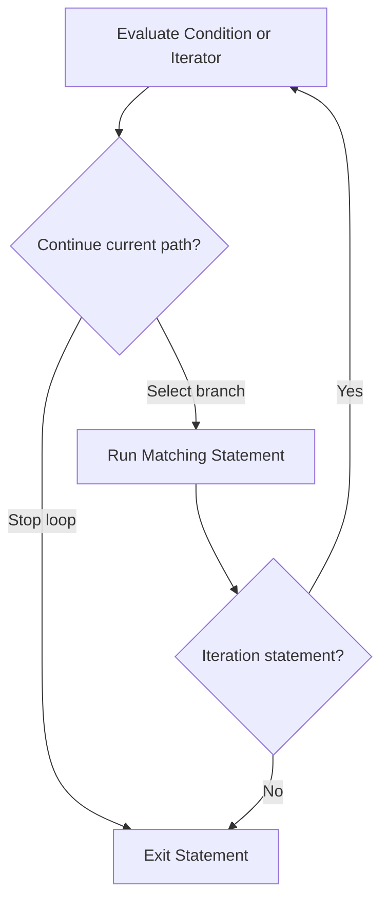

# CH-02: Selection and Iteration

> **"Statement pengambil keputusan dan pengulang kerja mengarahkan ke mana completion flow harus bergerak."**

**Source Hub**:
- [ECMA-262: If Statement](https://tc39.es/ecma262/#sec-if-statement)
- [ECMA-262: Switch Statement](https://tc39.es/ecma262/#sec-switch-statement)
- [ECMA-262: Iteration Statements](https://tc39.es/ecma262/#sec-iteration-statements)

---

## Mekanisme Inti

---

## Fokus Audit
1. `if` dan `switch` memilih jalur dengan evaluasi kondisi yang berbeda.
2. Iteration statements menjaga siklus evaluasi, body execution, dan abrupt completion handling.
3. `for...of` dan `for...in` harus dibaca sebagai statement yang bergantung pada protokol iterasi atau enumerasi, bukan sekadar sintaks loop.

---

## Lab Praktis

Buka file `examples/01_selection_iteration_lab.js` untuk melihat jalur `if`, `switch`, dan `for...of` menghasilkan aliran kontrol yang berbeda.

---
*Status: [x] Complete | [status.md](../../../docs/status.md)*
