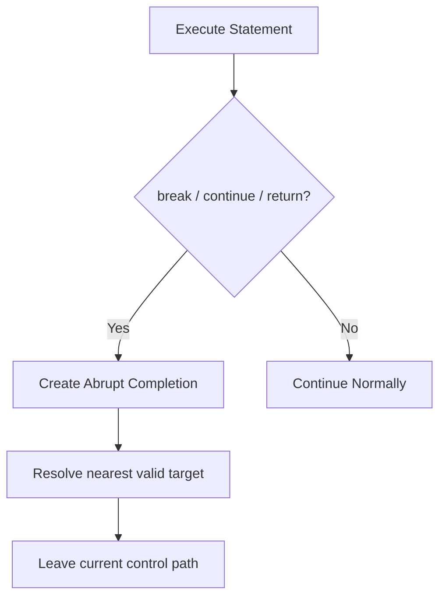

# CH-01: Control Transfer

> **"Transfer statements mengubah arah eksekusi dengan menghasilkan abrupt completion yang disengaja."**

**Source Hub**:
- [ECMA-262: Continue Statement](https://tc39.es/ecma262/#sec-continue-statement)
- [ECMA-262: Break Statement](https://tc39.es/ecma262/#sec-break-statement)
- [ECMA-262: Return Statement](https://tc39.es/ecma262/#sec-return-statement)

---

## Mekanisme Inti

---

## Fokus Audit
1. `break`, `continue`, dan `return` adalah completion records dengan target berbeda.
2. Label hanya valid jika target statement masih berada pada jalur yang sah.
3. Interupsi ini akan berinteraksi dengan `finally` jika jalurnya melewati try statement.

---

## Lab Praktis

Buka file `examples/01_control_transfer_lab.js` untuk melihat bagaimana labelled break dan return memutus eksekusi pada titik yang berbeda.

---
*Status: [x] Complete | [status.md](../../../docs/status.md)*
