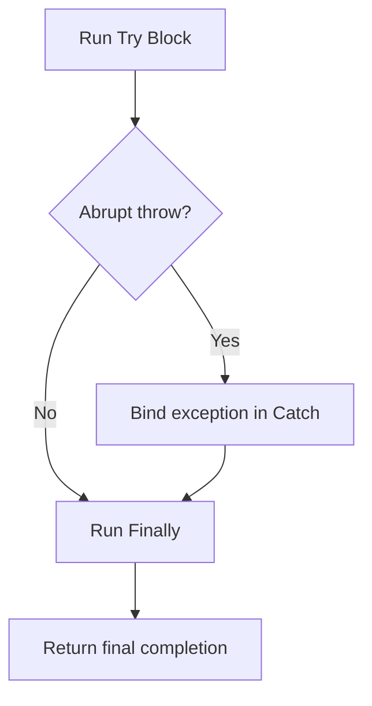

# CH-02: Exception Handling

> **"Try, catch, finally, dan throw adalah jalur resmi untuk menangkap serta meneruskan kegagalan eksekusi."**

**Source Hub**:
- [ECMA-262: Throw Statement](https://tc39.es/ecma262/#sec-throw-statement)
- [ECMA-262: Try Statement](https://tc39.es/ecma262/#sec-try-statement)

---

## Mekanisme Inti

---

## Fokus Audit
1. `throw` membuat completion bertipe throw yang akan mencari handler terdekat.
2. `catch` memiliki environment record sendiri untuk binding error.
3. `finally` selalu berkesempatan menimpa completion sebelumnya, sehingga urutan prioritasnya perlu dibaca hati-hati.

---

## Lab Praktis

Buka file `examples/01_exception_handling_lab.js` untuk melihat bagaimana `finally` tetap berjalan saat jalur `try` atau `catch` melakukan `return`.

---
*Status: [x] Complete | [status.md](../../../docs/status.md)*
