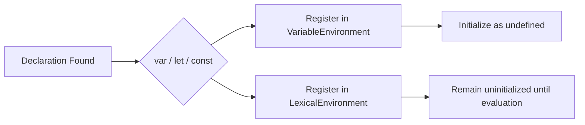

# CH-01: Variable Bindings

> **"Deklarasi binding menentukan kapan identifier didaftarkan, diinisialisasi, dan boleh diakses."**

**Source Hub**:
- [ECMA-262: Variable Statement](https://tc39.es/ecma262/#sec-variable-statement)
- [ECMA-262: Lexical Declarations](https://tc39.es/ecma262/#sec-let-and-const-declarations)

---

## Mekanisme Inti

---

## Fokus Audit
1. `var` dan lexical declarations berada pada jalur registrasi yang berbeda.
2. Hoisting adalah efek dari declaration instantiation, bukan pemindahan baris kode.
3. `const` menuntut initialization pada saat evaluasi deklarasi.

---

## Lab Praktis

Buka file `examples/01_variable_bindings_lab.js` untuk melihat perbedaan hoisting `var` dan TDZ pada `let` atau `const`.

---
*Status: [x] Complete | [status.md](../../../docs/status.md)*
