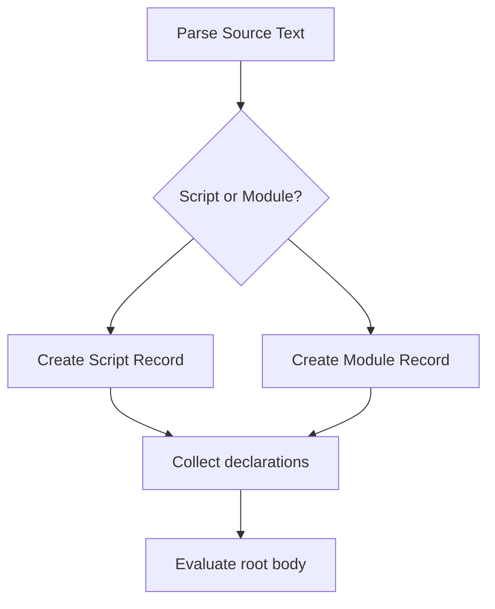

# CH-02: Scripts and Modules

> **"Di level statement, script dan module adalah wadah akar tempat deklarasi dikumpulkan sebelum eksekusi dimulai."**

**Source Hub**:
- [ECMA-262: Scripts](https://tc39.es/ecma262/#sec-scripts)
- [ECMA-262: Modules](https://tc39.es/ecma262/#sec-modules)

---

## Mekanisme Inti

---

## Fokus Audit
1. Script dan module punya root record yang berbeda sebelum masuk ke fase evaluate.
2. Hubungan chapter ini dengan `SR-10` bersifat jembatan, bukan duplikasi seluruh lifecycle module.
3. Perbedaan strictness, global bindings, dan linkage perlu dijaga tetap ringkas di sini.

---

## Lab Praktis

Buka file `examples/01_scripts_modules_bridge_lab.js` untuk membandingkan efek deklarasi global antara pola script-like dan namespace tertutup ala module.

---
*Status: [x] Complete | [status.md](../../../docs/status.md)*
