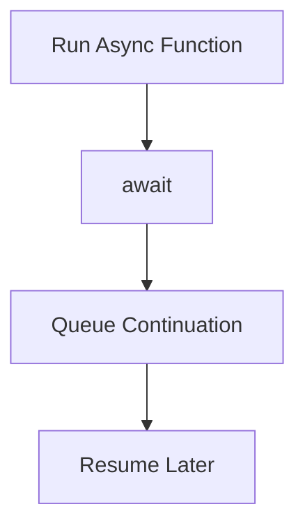

# CH-02: Async Pulsars

> **"Fungsi spesialis yang menunda kelanjutan eksekusi sampai sinyal asinkron siap."**

**Source Hub**:
- [ECMA-262: Async Function Definitions](https://tc39.es/ecma262/#sec-async-function-definitions)

---

## 1. Mental Model: "The Non-Blocking Wait"

Async function memecah alur kerja menjadi segmen sebelum dan sesudah `await`, sambil mengembalikan Promise sebagai kontrak luarnya.

---

## 2. Visualisasi Sistem: Await Continuation

---

## 3. Mekanisme & Hubungan

1. Async function selalu menghasilkan Promise.
2. `await` menangguhkan kelanjutan dan menjadwalkannya kembali sebagai microtask.
3. Ini membuat async function menjadi jembatan penting antara model fungsi dan model Promise.

---

## 4. Lab Praktis

Buka file `examples/01_async_pulsars_lab.js` untuk melihat async function menunggu Promise lalu melanjutkan eksekusi.

---
*Status: [x] Complete | [status.md](../../../docs/status.md)*
