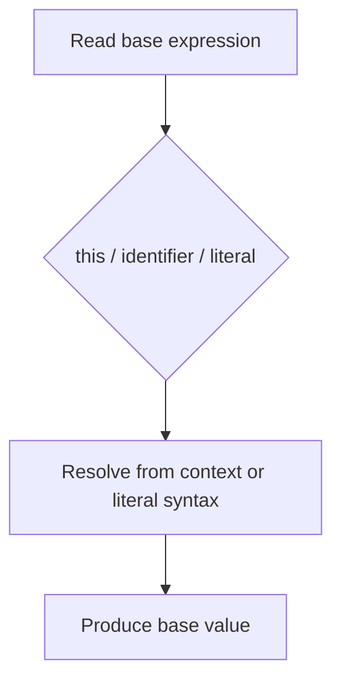

# CH-01: Base Expressions

> **"Base expressions adalah titik asal nilai primer seperti `this`, identifier, dan literal dasar."**

**Source Hub**:
- [ECMA-262: Primary Expressions](https://tc39.es/ecma262/#sec-primary-expressions)

## Lab Praktis
Buka file `examples/01_base_expressions_lab.js` untuk melihat `this`, identifier, dan literal menghasilkan nilai dasar yang berbeda.

*Status: [x] Complete | [status.md](../../../docs/status.md)*
