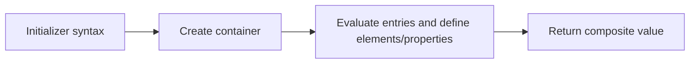

# CH-02: Initializers

> **"Initializers merakit array atau object value melalui langkah pembentukan internal."**

**Source Hub**:
- [ECMA-262: Array Initializer](https://tc39.es/ecma262/#sec-array-initializer)
- [ECMA-262: Object Initializer](https://tc39.es/ecma262/#sec-object-initializer)

## Lab Praktis
Buka file `examples/01_initializers_lab.js` untuk membandingkan array holes, spread, dan object property creation.

*Status: [x] Complete | [status.md](../../../docs/status.md)*
