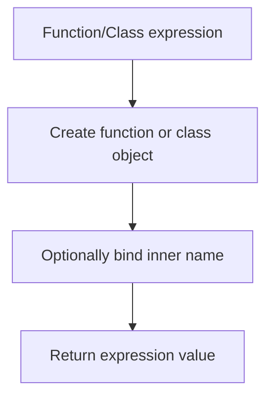

# CH-03: Function and Class Expressions

> **"Function dan class expressions membangun callable atau constructable value di tengah expression flow."**

**Source Hub**:
- [ECMA-262: Function Definitions](https://tc39.es/ecma262/#sec-function-definitions)
- [ECMA-262: Class Definitions](https://tc39.es/ecma262/#sec-class-definitions)

## Lab Praktis
Buka file `examples/01_function_class_expressions_lab.js` untuk melihat function expression dan class expression dihasilkan sebagai value.

*Status: [x] Complete | [status.md](../../../docs/status.md)*
