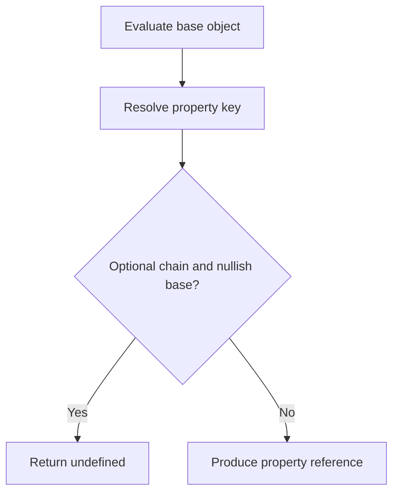

# CH-01: Property Access

> **"Property access menelusuri object graph untuk menghasilkan reference ke properti yang dituju."**

**Source Hub**:
- [ECMA-262: Property Accessors](https://tc39.es/ecma262/#sec-property-accessors)
- [ECMA-262: Optional Chaining Operator](https://tc39.es/ecma262/#sec-optional-chaining-operator)

## Lab Praktis
Buka file `examples/01_property_access_lab.js` untuk membandingkan dot access, computed access, dan optional chaining.

*Status: [x] Complete | [status.md](../../../docs/status.md)*
