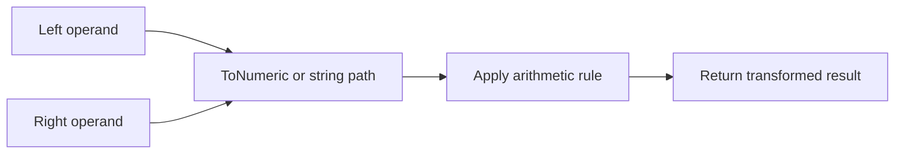

# CH-01: Arithmetic

> **"Arithmetic operators mentransformasikan operand menjadi hasil numerik atau konkatenatif yang baru."**

**Source Hub**:
- [ECMA-262: Multiplicative Operators](https://tc39.es/ecma262/#sec-multiplicative-operators)
- [ECMA-262: Additive Operators](https://tc39.es/ecma262/#sec-additive-operators)

## Lab Praktis
Buka file `examples/01_arithmetic_lab.js` untuk membandingkan transformasi aritmatika dan perilaku `+` saat string ikut terlibat.

*Status: [x] Complete | [status.md](../../../docs/status.md)*
