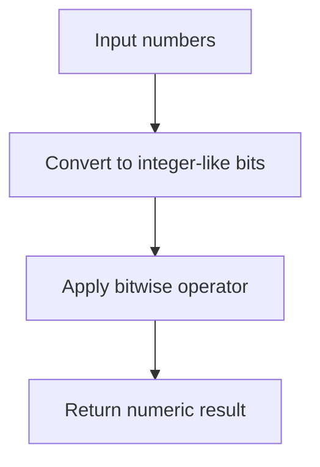

# CH-02: Bitwise

> **"Bitwise operators mengubah nilai melalui representasi bit-level yang dipersempit."**

**Source Hub**:
- [ECMA-262: Binary Bitwise Operators](https://tc39.es/ecma262/#sec-binary-bitwise-operators)

## Lab Praktis
Buka file `examples/01_bitwise_lab.js` untuk melihat bagaimana `&`, `|`, dan `^` mengubah representasi biner operand.

*Status: [x] Complete | [status.md](../../../docs/status.md)*
