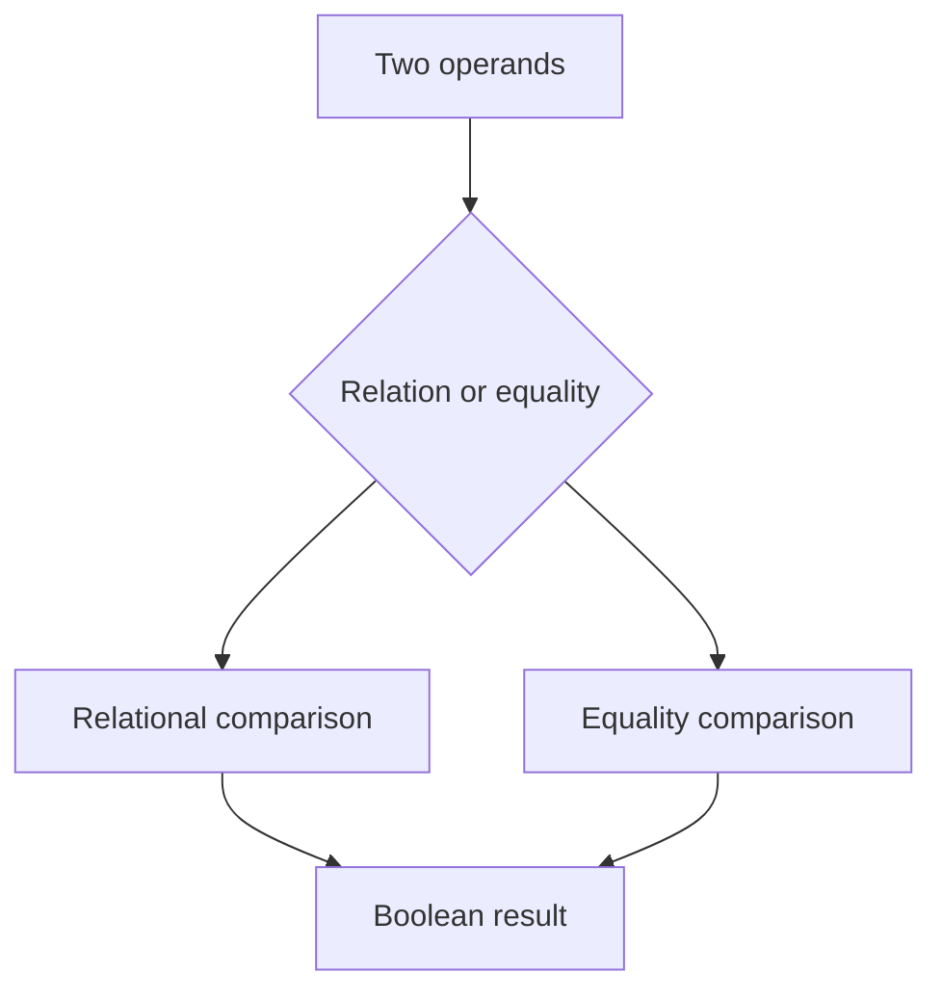

# CH-01: Relational Equality

> **"Comparison flow memutuskan relasi dan kesetaraan berdasarkan algoritma yang berbeda."**

**Source Hub**:
- [ECMA-262: Relational Operators](https://tc39.es/ecma262/#sec-relational-operators)
- [ECMA-262: Equality Operators](https://tc39.es/ecma262/#sec-equality-operators)

## Lab Praktis
Buka file `examples/01_relational_equality_flow_lab.js` untuk melihat bagaimana operator relation dan equality memilih hasil boolean.

*Status: [x] Complete | [status.md](../../../docs/status.md)*
