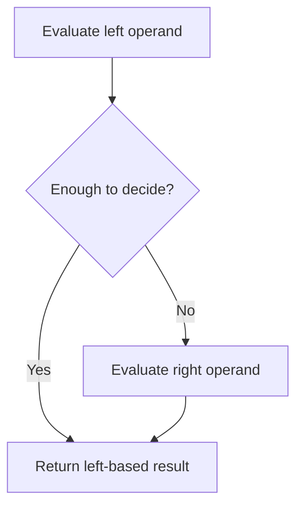

# CH-02: Short Circuiting

> **"Short-circuit operators menghentikan evaluasi lebih awal saat hasil jalur sudah cukup ditentukan."**

**Source Hub**:
- [ECMA-262: Binary Logical Operators](https://tc39.es/ecma262/#sec-binary-logical-operators)

## Lab Praktis
Buka file `examples/01_short_circuiting_lab.js` untuk melihat kapan operand kanan dijalankan dan kapan dilewati.

*Status: [x] Complete | [status.md](../../../docs/status.md)*
