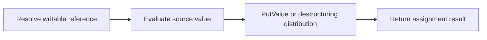

# CH-01: Assignments

> **"Assignment flow menyalurkan hasil evaluasi akhir ke target reference yang bisa ditulis."**

**Source Hub**:
- [ECMA-262: Assignment Operators](https://tc39.es/ecma262/#sec-assignment-operators)

## Lab Praktis
Buka file `examples/01_assignments_lab.js` untuk melihat simple assignment, compound assignment, dan destructuring berjalan pada target berbeda.

*Status: [x] Complete | [status.md](../../../docs/status.md)*
