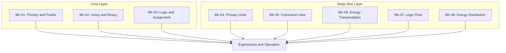

# SR-07: Expressions and Operators (The Flow Controls)

> **"Bagaimana nilai dibentuk, ditransformasikan, diuji, dan akhirnya didistribusikan melalui operator."**

**Source Hub**:
- [ECMA-262: ECMAScript Language: Expressions](https://tc39.es/ecma262/#sec-ecmascript-language-expressions)

---

## The 8-Book Structural Architecture

---

## Koleksi Buku
1. **[BK-01: Primary and Postfix Expressions](./BK-01_PrimaryAndPostfix/)**: primary expressions, property access, calls, `new`, dan update operators.
2. **[BK-02: Unary and Binary Operators](./BK-02_UnaryAndBinary/)**: unary, exponentiation, arithmetic, shift, relational, equality, bitwise, dan logical operators.
3. **[BK-03: Logic and Assignment](./BK-03_LogicAndAssignment/)**: conditional operator, assignment operators, logical assignment, dan comma.
4. **[BK-04: Primary Units](./BK-04_PrimaryUnits/)**: pendalaman base expressions, initializers, serta function/class expressions.
5. **[BK-05: Command Links](./BK-05_CommandLinks/)**: pendalaman property access dan execution calls sebagai jalur reference.
6. **[BK-06: Energy Transmutation](./BK-06_EnergyTransmutation/)**: pendalaman arithmetic dan bitwise transformation.
7. **[BK-07: Logic Flow](./BK-07_LogicFlow/)**: pendalaman relational/equality serta short-circuit decision flow.
8. **[BK-08: Energy Distribution](./BK-08_EnergyDistribution/)**: pendalaman assignment semantics dan distribusi hasil evaluasi ke target reference.

---

## Catatan Audit Struktur

`SR-07` kini diperlakukan sebagai sub-rak 8 buku:
- `BK-01` sampai `BK-03` adalah jalur inti expressions dan operator.
- `BK-04` sampai `BK-08` adalah jalur pendalaman yang sebelumnya hidup paralel dan kini dinormalisasi sebagai buku eksplisit.

---
*Status: [/] Partial | [status.md](../docs/status.md) | Back to [RAK-04](../README.md)*
