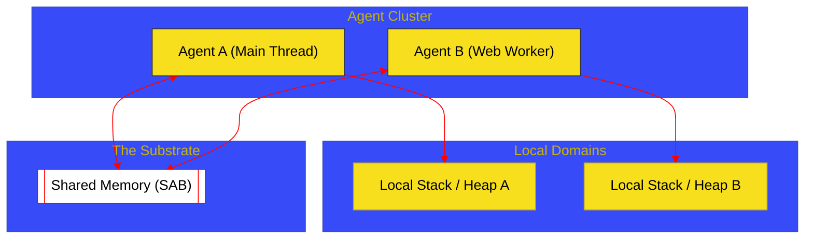

# BK-01: Memory Model & Agent Clusters (Clause 29)

> **"Substrat & Isolasi: Bagaimana Hub Mendefinisikan Wilayah Kekuasaan Memori (Agents) dan Menjaga Konsistensi Operasi pada Tingkat Bit."**

---

## 🌓 1. Essence: The Narrative

### Dual Definition
- **Formal**: Spesifikasi mengenai infrastruktur memori tempat ECMAScript beroperasi. Mencakup **Agent Clusters** (unit isolasi utama), **Execution Contexts** (unit eksekusi), dan **Memory Model** yang mendefinisikan bagaimana operasi baca/tulis pada memori bersama disinkronkan.
- **Analogi**: Bayangkan sebuah **Kompleks Perkantoran**. Setiap kantor adalah sebuah **Agent**. Di dalam kantor tersebut, karyawan (Execution Context) bekerja di meja mereka sendiri (**Stack/Local Memory**) tanpa bisa melihat meja di kantor lain. Namun, ada sebuah perpustakaan pusat (**Shared Memory**) di mana semua kantor bisa meminjam dan menulis buku yang sama. Aturan perpustakaan (**Memory Model**) memastikan bahwa jika Kantor A menulis bab baru, Kantor B tidak akan membaca versi lama yang membingungkan.

---

## 🗺️ 2. Visual Logic: Agent Domain Architecture

Struktur isolasi dan hubungan antara Agent dengan memori:

---

## 🏛️ 3. Strategic Chapters (Levels 5)

Wilayah memori dan unit isolasi:

1.  **[CH-01: Agent and Cluster Lifecycle](./CH-01_MemoryDomains/)**
    *Definisi Agent, Agent Clusters, dan bagaimana mereka memiliki Realm-nya sendiri.*
2.  **[CH-02: Memory Consistency Model](./CH-02_ObjectVitality/)**
    *Aturan visibilitas memori (Read-Write consistency) dan Sequential Consistency.*

---

## 🧠 4. Under-the-hood: The Agent Candidate
Dalam spesifikasi, **Agent** bukanlah sekadar "thread". Agent adalah abstraksi yang memiliki **Call Stack**, sebuah **Execution Context Stack**, dan seperangkat **Realm**. Meskipun satu thread di browser (Main Thread) adalah satu Agent, ia bisa membagi tugas ke Agent lain (Worker) yang memiliki memori lokalnya sendiri. Komunikasi antar Agent inilah yang mendasari sirkuit asinkron dan paralel di dalam Hub.

---

## 🎖️ 5. The Gold Standard Checklist
- [x] **Spec-Alignment**: Sinkronisasi dengan Clause 29 (Memory Model).
- [x] **Visual Logic**: Mermaid diagram untuk Agent Domain Architecture.
- [x] **Mental Model**: Analogi "Kompleks Perkantoran & Perpustakaan Pusat".

---
*Buku Status: [x] Complete | [status.md](../../docs/status.md) | Kembali ke [SR-08](../README.md)*
