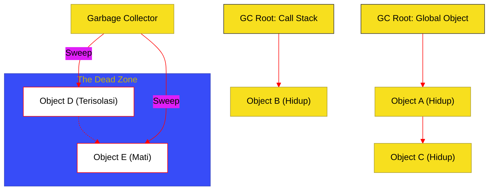

# BK-02: Garbage Collection Mechanics

> **"Daur Ulang Energi: Bagaimana Hub Mengidentifikasi Objek yang Tidak Lagi Memiliki Nyawa (Liveness) dan Mengembalikan Ruang Memori ke Sistem."**

---

## 🌓 1. Essence: The Narrative

### Dual Definition
- **Formal**: Spesifikasi mengenai manajemen memori otomatis yang dilakukan oleh engine. Mencakup identifikasi **GC Roots**, penentuan **Reachability** (keterjangkauan), dan eksekusi algoritma pembersihan untuk memulihkan memori yang tidak lagi dirujuk oleh program.
- **Analogi**: Bayangkan sebuah **Sistem Pengelolaan Sampah Kota**. Setiap rumah (Objek) yang masih ditingali (dirujuk) oleh warga (GC Roots seperti Global Object atau Stack) dianggap "hidup". Petugas kebersihan (**Garbage Collector**) secara berkala memeriksa seluruh kota. Jika mereka menemukan rumah yang sudah tidak memiliki akses jalan dari pusat kota (tidak terjangkau), rumah tersebut akan dihancurkan dan tanahnya (**Memory Space**) akan digunakan untuk membangun fasilitas baru.

---

## 🗺️ 2. Visual Logic: The GC Reachability Tree

Bagaimana objek diklasifikasikan sebagai "Hidup" atau "Mati":

---

## 🏛️ 3. Strategic Chapters (Levels 5)

Mekanisme daur ulang memori:

1.  **[CH-01: Liveness and Reachability Analysis](./CH-01_EnergyLeaks/)**
    *Definisi GC Roots dan bagaimana graph objek ditelusuri untuk menentukan nyawa.*
2.  **[CH-02: Collection Algorithms (Mark-Sweep & Scavenge)](./CH-02_EfficiencyAudits/)**
    *Strategi engine dalam membagi memori (Young vs Old Generation) dan algoritma pembersihan.*

---

## 🧠 4. Under-the-hood: The Mark-and-Sweep Cycle
Mayoritas engine menggunakan siklus **Mark-and-Sweep**. Pada tahap **Mark**, GC menandai semua objek yang bisa dijangkau dari Roots. Pada tahap **Sweep**, semua objek yang tidak ditandai akan dihapus. Untuk efisiensi, engine modern membagi heap menjadi **Young Generation** (objek yang baru lahir dan sering mati) dan **Old Generation** (objek yang bertahan lama), memungkinkan pembersihan yang lebih cepat pada wilayah yang paling dinamis.

---

## 🎖️ 5. The Gold Standard Checklist
- [x] **Spec-Alignment**: Konsep Reachability sesuai dengan paradigma ECMAScript.
- [x] **Visual Logic**: Mermaid diagram untuk GC Reachability Tree.
- [x] **Mental Model**: Analogi "Sistem Pengelolaan Sampah Kota".

---
*Buku Status: [x] Complete | [status.md](../../docs/status.md) | Kembali ke [SR-08](../README.md)*
