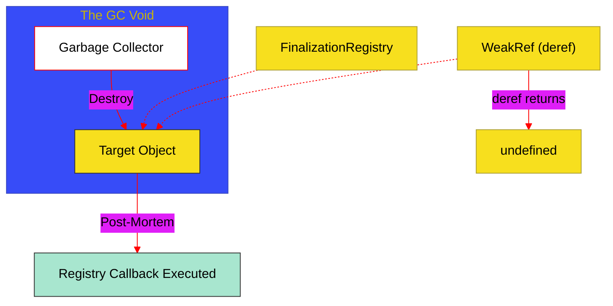

# BK-03: Weak References & Finalization

> **"Koneksi Bayangan & Protokol Akhir: Bagaimana Hub Berinteraksi dengan Objek Tanpa Menahan Siklus Hidupnya dan Mengatur Pembersihan Pasca-Kematian Objek."**

---

## 🌓 1. Essence: The Narrative

### Dual Definition
- **Formal**: Spesifikasi mengenai penggunaan **WeakRef** untuk merujuk objek tanpa mencegah pembersihan oleh Garbage Collector (GC), serta penggunaan **FinalizationRegistry** untuk mendaftarkan *callback* yang akan dipicu setelah objek dihancurkan.
- **Analogi**: Bayangkan sebuah **Kartu Anggota Perpustakaan** (Strong Reference). Selama Anda memegang kartu itu, Anda memiliki akses penuh ke buku tersebut. Namun, **WeakRef** adalah seperti **Scan QR** pada sampul buku. Anda bisa melihat informasi bukunya, tetapi jika perpustakaan memutuskan untuk membuang buku tersebut (GC), Scan QR Anda tidak akan bisa mencegahnya. **FinalizationRegistry** adalah **Surat Wasiat**; ia memberi tahu pustakawan untuk melakukan tugas tertentu (seperti mencatat statistik) hanya setelah buku tersebut benar-benar dibakar atau dibuang.

---

## 🗺️ 2. Visual Logic: Finalization Lifecycle

Aliran interaksi antara WeakRef, Registry, dan Garbage Collector:

---

## 🏛️ 3. Strategic Chapters (Levels 5)

Pengelolaan sumber daya non-blocking:

1.  **[CH-01: WeakRef and Ghost Connections](./CH-01_GhostConnections/)**
    *Mekanisme deref(), target liveness, dan strategi caching tanpa memory leak.*
2.  **[CH-02: FinalizationRegistry Protocols](./CH-02_PostMortemCleanup/)**
    *Pendaftaran unregister tokens, held values, dan manajemen cleanup asinkron.*

---

## 🧠 4. Under-the-hood: The Non-Deterministic Hazard
Satu hal paling kritis tentang **WeakRef** dan **FinalizationRegistry** adalah sifatnya yang **Non-Deterministik**. Spesifikasi ECMAScript tidak menjamin *kapan* atau bahkan *apakah* GC akan berjalan dan memicu callback registry. Oleh karena itu, fitur ini dilarang keras digunakan untuk logika bisnis inti (seperti penutupan file database yang harus pasti). Ia hanya boleh digunakan untuk optimasi (seperti cache) atau observasi tingkat rendah.

---

## 🎖️ 5. The Gold Standard Checklist
- [x] **Spec-Alignment**: Definisi WeakRef/Registry sesuai spesifikasi modern.
- [x] **Visual Logic**: Mermaid diagram untuk Finalization Lifecycle.
- [x] **Mental Model**: Analogi "Scan QR & Surat Wasiat".

---
*Buku Status: [x] Complete | [status.md](../../docs/status.md) | Kembali ke [SR-08](../README.md)*
