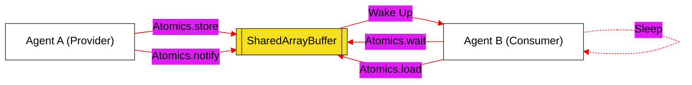

# BK-04: Atomics & Shared Memory (Clause 29)

> **"Sinkronisasi Antar-Agen: Bagaimana Hub Mengelola Memori Bersama dan Operasi Atomik untuk Mencegah Kebocoran Data dalam Arsitektur Multi-Thread."**

---

## 🌓 1. Essence: The Narrative

### Dual Definition
- **Formal**: Spesifikasi mengenai objek **Atomics** dan tipe data **SharedArrayBuffer** yang memungkinkan beberapa Agent dalam satu Agent Cluster untuk berbagi dan memanipulasi rentang memori yang sama secara aman. Mencakup operasi primitif yang tidak dapat diinterupsi (atomic) dan mekanisme *Wait-Notify*.
- **Analogi**: Bayangkan sebuah **Dokumen Google Docs** yang dikerjakan oleh 10 orang secara bersamaan. Jika semua orang menulis di baris yang sama tanpa aturan, dokumen akan berantakan (**Data Race**). **SharedArrayBuffer** adalah dokumen itu sendiri. **Atomics** adalah sistem kunci (Locking) yang memastikan bahwa hanya satu orang yang bisa mengubah sebuah angka pada satu waktu. `Atomics.wait` adalah instruksi bagi seorang penulis untuk menunggu sampai penulis lain memberi sinyal `Atomics.notify` bahwa bagian tersebut sudah selesai diperbarui.

---

## 🗺️ 2. Visual Logic: Atomic Synchronization Flow

Bagaimana dua Agent berkomunikasi melalui memori bersama tanpa konflik:

---

## 🏛️ 3. Strategic Chapters (Levels 5)

Konkurensi dan manajemen sinkronisasi:

1.  **[CH-01: SharedArrayBuffer Architecture](./CH-01_SharedMemory/)**
    *Infrastruktur SAB: Alokasi memori bersama dan perbedaan internal slot dengan ArrayBuffer biasa.*
2.  **[CH-02: The Atomics Object and Wait/Notify](./CH-02_AtomicOperations/)**
    *Operasi atomik (Add, Sub, Xor) dan sistem komunikasi inter-agent melalui wait/notify.*

---

## 🧠 4. Under-the-hood: The Atomic Primitive
Operasi **Atomic** dijamin oleh spesifikasi untuk bersifat *indivisible* (tidak dapat dibagi). Ini berarti saat Hub melakukan `Atomics.add()`, operasi baca, tambah, dan tulis terjadi dalam satu langkah di level hardware, sehingga tidak ada Agent lain yang bisa menginterupsi di tengah-tengah proses tersebut. Tanpa atomicity, dua Agent yang menambah angka pada saat yang sama bisa menghasilkan nilai yang salah (misal: 1+1=1 jika keduanya membaca nilai 0 secara bersamaan).

---

## 🎖️ 5. The Gold Standard Checklist
- [x] **Spec-Alignment**: Sinkronisasi penuh dengan Clause 29 (Atomics).
- [x] **Visual Logic**: Mermaid diagram untuk Atomic Synchronization.
- [x] **Repair**: Penghapusan materi "Memory Optimization" yang tidak relevan dengan Core Spec.

---
*Buku Status: [x] Complete | [status.md](../../docs/status.md) | Kembali ke [SR-08](../README.md)*
