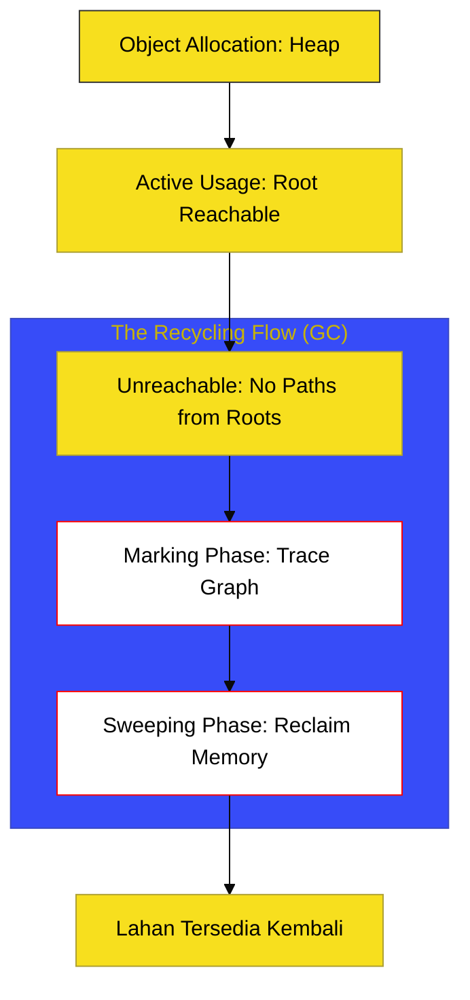

# SR-08: Memory & Resource Landscape

> **"Sistem Ekosistem & Daur Ulang: Menyeimbangkan Alokasi Partikel Baru dan Pembersihan Residu untuk Stabilitas Reaktor."**

---

## 🔗 Source Hub
- **Primary Source**: [ECMA-262: Memory Model (Clause 28)](https://tc39.es/ecma262/#sec-memory-model)
- **Technical Reference**: [V8 Blog: Garbage Collection](https://v8.dev/blog/trash-talk)

---

## 🌓 1. Essence: The Narrative

### Dual Definition
- **Formal**: Spesifikasi mengenai model memori ECMAScript, mencakup aturan urutan memori (Memory Consistency), operasi atomik untuk sinkronisasi antar agen, serta mekanisme pengelolaan siklus hidup objek (Alokasi & Garbage Collection).
- **Analogi**: Bayangkan sebuah **Kota yang Mengelola Sampahnya Mandiri** (Runtime). Setiap kali ada bangunan baru didirikan (**Alokasi**), kota harus menyediakan lahan. Jika bangunan tersebut tidak lagi dihuni dan tidak ada jalan setapak (referensi) menuju ke sana, tim kebersihan (**Garbage Collector**) akan merobohkannya untuk mendaur ulang lahannya. Di saat yang sama, sensor-sensor atomik (**Atomics**) memastikan tidak ada dua truk sampah yang berebut lahan yang sama di jalanan yang sibuk (Shared Memory).

---

## 🗺️ 2. Visual Logic: The Memory Cycle
Bagaimana JavaScript menjaga efisiensi penggunaan sumber daya:

---

## 🏛️ 3. Strategic Books (The Tracks)

1.  **[BK-01: Memory Model](./BK-01_MemoryModel/)**
    *Infrastruktur Memory Consistency dan aturan sinkronisasi.*
2.  **[BK-02: Garbage Collection](./BK-02_GarbageCollection/)**
    *Mekanika Mark-and-Sweep, Generational GC, dan Scavenging.*
3.  **[BK-03: Weak References](./BK-03_WeakReferences/)**
    *Penggunaan WeakRef, FinalizationRegistry, dan monitor residu.*
4.  **[BK-04: Atomics & Shared Memory](./BK-04_AtomicsShared/)**
    *Operasi atomik, Wait/Notify, dan sinkronisasi lintas Agent.*

---

## 🧠 4. Under-the-hood: The Memory Graph
Keajaiban Garbage Collection di JavaScript didasarkan pada **Root Reachability**. Engine tidak sekadar menghitung jumlah referensi (seperti teknik *Reference Counting* lama yang rentan terhadap *Circular Dependency*), melainkan melakukan pemindaian grafik dari "Roots" (seperti `globalThis` dan tumpukan eksekusi aktif). Objek yang tidak memiliki jalur dari Roots, seberapa banyak pun referensi internal di antaranya, akan dianggap sebagai "residu" dan didaur ulang.

---
*Status: [/] Reconstruction in Progress. Mengacu pada Blueprint RAK-04.*
