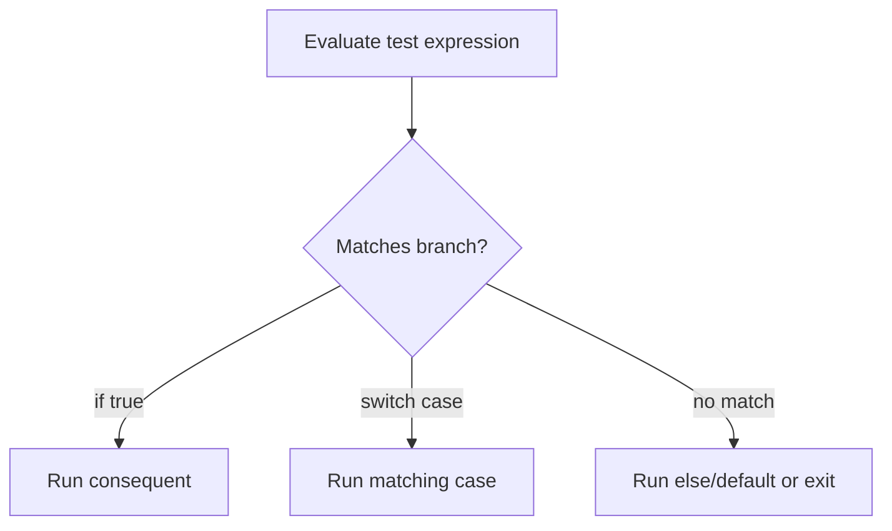

# CH-01: Selection Units

> **"Unit seleksi memetakan satu kondisi ke satu jalur statement yang sah."**

**Source Hub**:
- [ECMA-262: If Statement](https://tc39.es/ecma262/#sec-if-statement)
- [ECMA-262: Switch Statement](https://tc39.es/ecma262/#sec-switch-statement)

---

## Mekanisme Inti

---

## Fokus Audit
1. `if` memakai jalur boolean conversion, sedangkan `switch` memakai case matching.
2. Fall-through pada `switch` adalah perilaku default sampai `break` mengubah jalurnya.
3. Buku pendalaman ini harus tetap menjelaskan mekanisme statement, bukan gaya coding umum.

---

## Lab Praktis

Buka file `examples/01_selection_units_lab.js` untuk mengamati perbedaan aliran `if` dan `switch` saat kondisi berubah.

---
*Status: [x] Complete | [status.md](../../../docs/status.md)*
