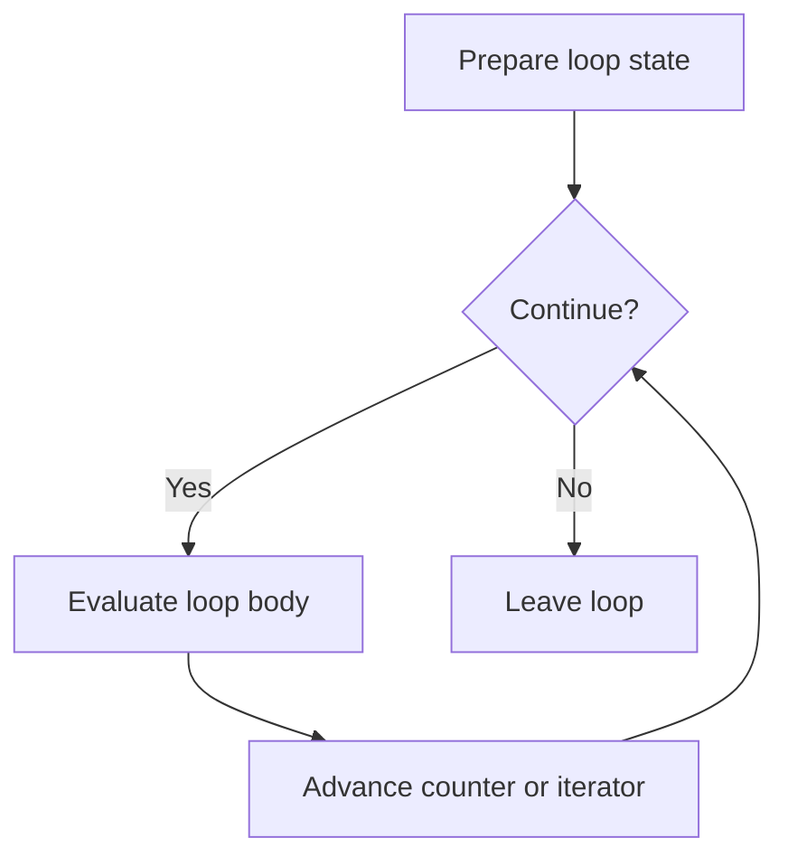

# CH-02: Iteration Units

> **"Loop statements adalah unit kerja berulang yang terus memproses body sampai kondisi atau iterator mengizinkan berhenti."**

**Source Hub**:
- [ECMA-262: Iteration Statements](https://tc39.es/ecma262/#sec-iteration-statements)
- [ECMA-262: For-In and For-Of Statements](https://tc39.es/ecma262/#sec-for-in-and-for-of-statements)

---

## Mekanisme Inti

---

## Fokus Audit
1. Setiap loop punya urutan setup, condition, body, dan update yang berbeda.
2. `for...of` menambah interaksi dengan iterator protocol dan cleanup iterator.
3. Abrupt completion di tengah loop harus dibaca bersama resolusi target statement.

---

## Lab Praktis

Buka file `examples/01_iteration_units_lab.js` untuk melihat perbedaan loop counter biasa dan `for...of` berbasis iterator.

---
*Status: [x] Complete | [status.md](../../../docs/status.md)*
