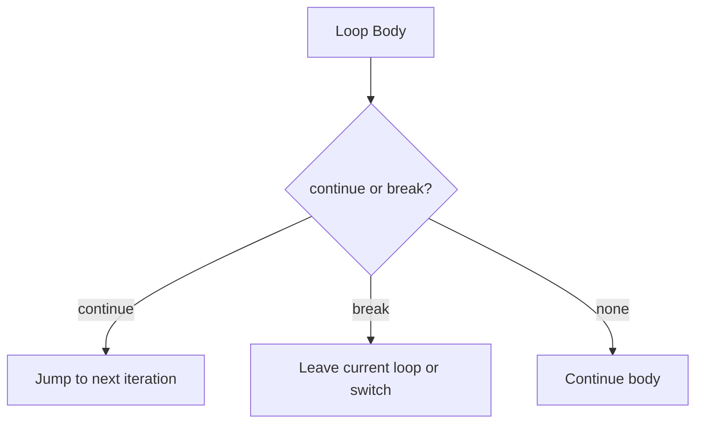

# CH-01: Local Interrupts

> **"Interrupt lokal menghentikan atau melanjutkan alur di dalam statement yang masih berada pada konteks terdekat."**

**Source Hub**:
- [ECMA-262: Continue Statement](https://tc39.es/ecma262/#sec-continue-statement)
- [ECMA-262: Break Statement](https://tc39.es/ecma262/#sec-break-statement)

---

## Mekanisme Inti

---

## Fokus Audit
1. Interrupt lokal bekerja tanpa harus keluar dari seluruh function.
2. `continue` hanya sah pada iteration statements, sedangkan `break` juga sah pada `switch`.
3. Resolusi target terjadi sebelum alur kembali normal.

---

## Lab Praktis

Buka file `examples/01_local_interrupts_lab.js` untuk melihat perbedaan efek `continue` dan `break` pada loop yang sama.

---
*Status: [x] Complete | [status.md](../../../docs/status.md)*
