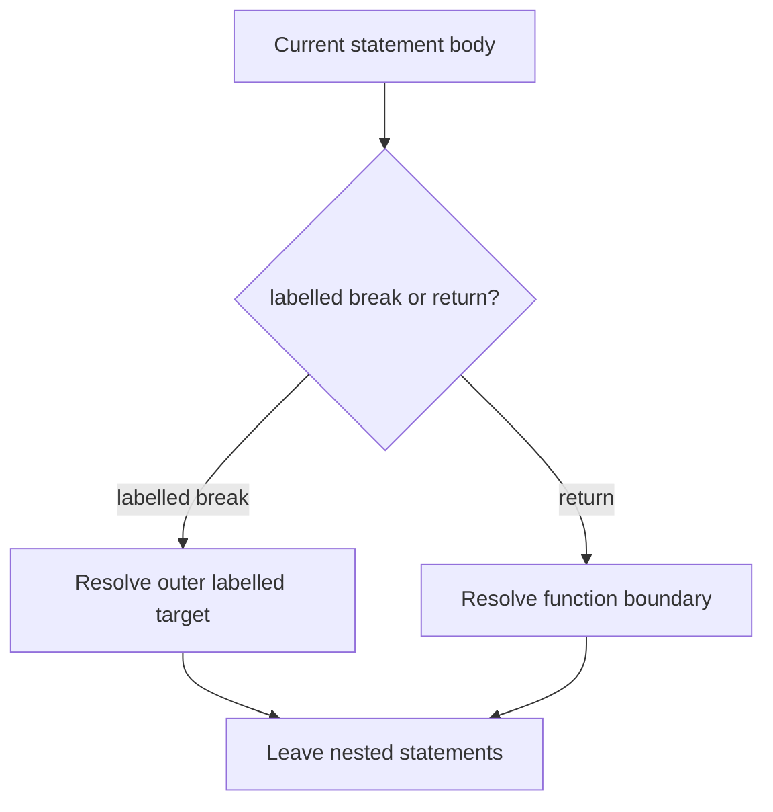

# CH-02: External Interrupts

> **"Interrupt eksternal melintasi batas statement lokal dan membawa aliran ke target yang lebih luar."**

**Source Hub**:
- [ECMA-262: Labelled Statements](https://tc39.es/ecma262/#sec-labelled-statements)
- [ECMA-262: Return Statement](https://tc39.es/ecma262/#sec-return-statement)

---

## Mekanisme Inti

---

## Fokus Audit
1. Labelled break adalah target-based interrupt ke luar dari statement bersarang.
2. `return` selalu mencari batas function, bukan loop.
3. Chapter ini menjelaskan perpindahan completion lintas boundary statement secara eksplisit.

---

## Lab Praktis

Buka file `examples/01_external_interrupts_lab.js` untuk melihat labelled break dan return menarget boundary yang berbeda.

---
*Status: [x] Complete | [status.md](../../../docs/status.md)*
