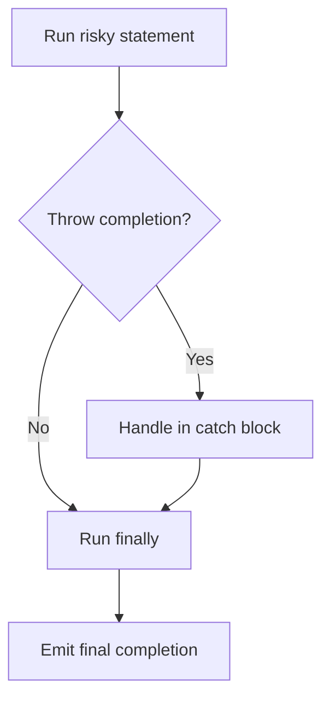

# CH-03: Safety Vault

> **"Safety vault menjaga kegagalan tetap terkurung sambil memastikan cleanup path tetap dieksekusi."**

**Source Hub**:
- [ECMA-262: Try Statement](https://tc39.es/ecma262/#sec-try-statement)
- [ECMA-262: Throw Statement](https://tc39.es/ecma262/#sec-throw-statement)

---

## Mekanisme Inti

---

## Fokus Audit
1. `try/catch/finally` adalah containment path untuk abrupt completion.
2. `finally` tetap berhak memodifikasi completion terakhir.
3. Pendalaman ini menyorot containment semantics, bukan sekadar pola penanganan error.

---

## Lab Praktis

Buka file `examples/01_safety_vault_lab.js` untuk melihat bagaimana nilai hasil dapat berubah ketika `finally` ikut mengembalikan completion baru.

---
*Status: [x] Complete | [status.md](../../../docs/status.md)*
