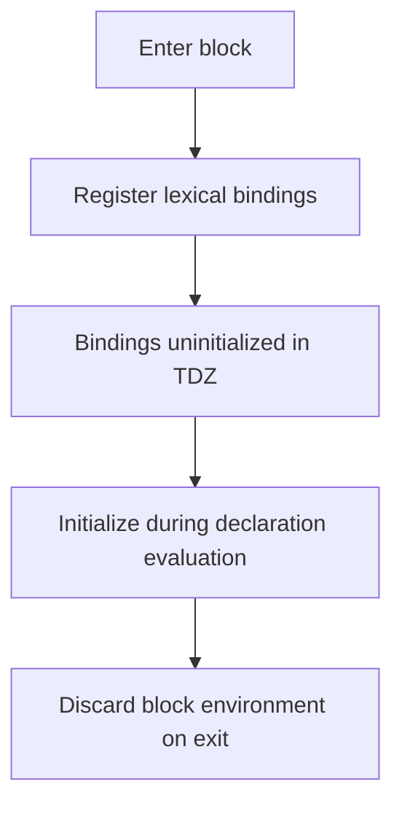

# CH-01: Block Scoped Allocation

> **"Binding block-scoped dibuat untuk hidup tepat di dalam batas blok yang mendeklarasikannya."**

**Source Hub**:
- [ECMA-262: Let and Const Declarations](https://tc39.es/ecma262/#sec-let-and-const-declarations)
- [ECMA-262: BlockDeclarationInstantiation](https://tc39.es/ecma262/#sec-blockdeclarationinstantiation)

---

## Mekanisme Inti

---

## Fokus Audit
1. `let` dan `const` menggunakan declarative environment milik blok.
2. TDZ menjelaskan mengapa akses sebelum inisialisasi gagal walau binding sudah diketahui.
3. Pendalaman ini membantu memisahkan allocation model modern dari model legacy `var`.

---

## Lab Praktis

Buka file `examples/01_block_scoped_allocation_lab.js` untuk melihat batas hidup binding block-scoped dan efek TDZ.

---
*Status: [x] Complete | [status.md](../../../docs/status.md)*
