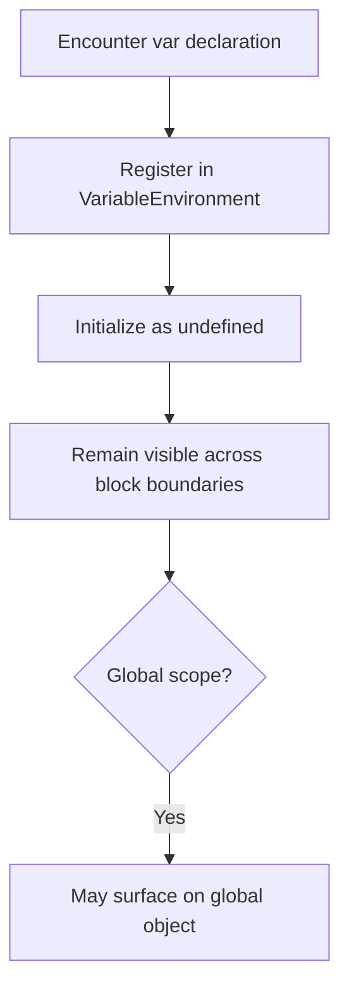

# CH-02: Legacy Allotment

> **"Legacy allocation menjelaskan mengapa `var` tetap mengikuti function scope dan global object behavior lama."**

**Source Hub**:
- [ECMA-262: Variable Statement](https://tc39.es/ecma262/#sec-variable-statement)
- [ECMA-262: GlobalDeclarationInstantiation](https://tc39.es/ecma262/#sec-globaldeclarationinstantiation)

---

## Mekanisme Inti

---

## Fokus Audit
1. `var` tidak tunduk pada block scope biasa.
2. Binding legacy membantu menjelaskan kebocoran scope dan perilaku global lama.
3. Chapter ini menjaga boundary antara model warisan dan model lexical modern.

---

## Lab Praktis

Buka file `examples/01_legacy_allotment_lab.js` untuk membandingkan kebocoran `var` terhadap keterikatan `let`.

---
*Status: [x] Complete | [status.md](../../../docs/status.md)*
