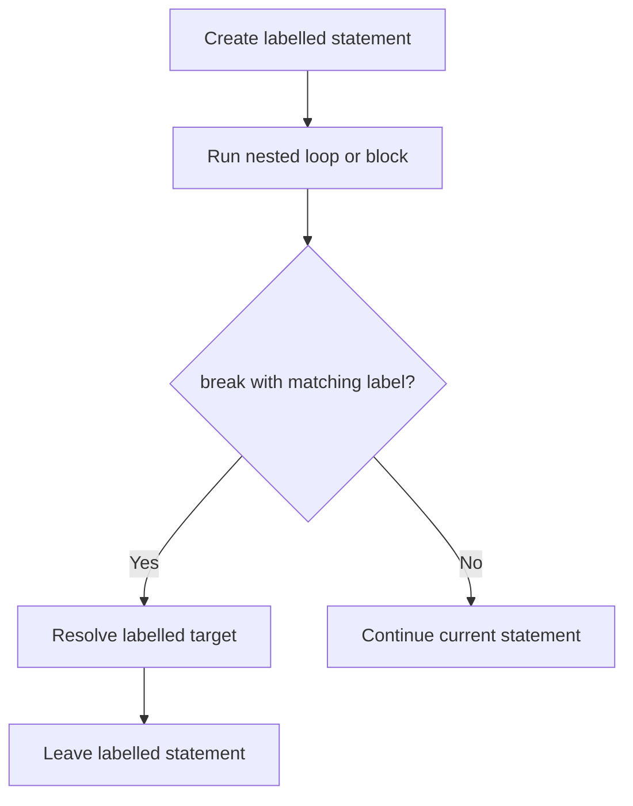

# CH-01: Label Statements

> **"Label memberi nama pada statement sehingga abrupt completion tertentu dapat menarget jalur yang lebih spesifik."**

**Source Hub**:
- [ECMA-262: Labelled Statements](https://tc39.es/ecma262/#sec-labelled-statements)
- [ECMA-262: Break Statement](https://tc39.es/ecma262/#sec-break-statement)

---

## Mekanisme Inti

---

## Fokus Audit
1. Label adalah metadata target, bukan fitur goto bebas.
2. Validitas label selalu terkait dengan statement yang sedang melingkupinya.
3. Penggunaan label harus dibaca bersama mekanisme break atau continue yang memakainya.

---

## Lab Praktis

Buka file `examples/01_label_statements_lab.js` untuk melihat bagaimana labelled break keluar dari loop bersarang dalam satu langkah.

---
*Status: [x] Complete | [status.md](../../../docs/status.md)*
