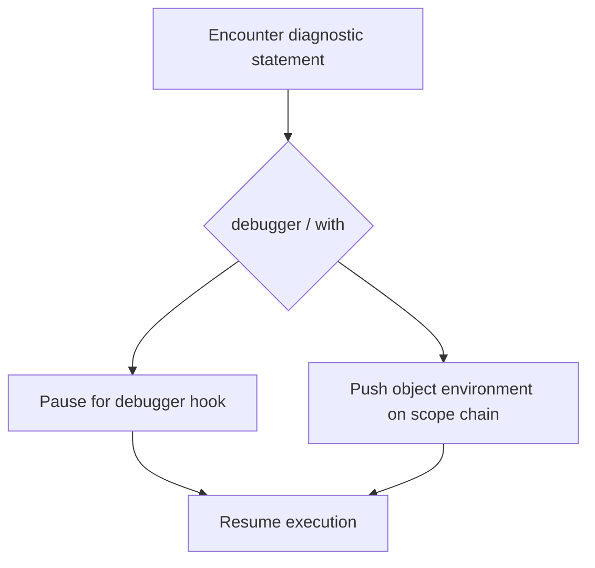

# CH-02: Diagnostic Units

> **"Diagnostic statements membantu inspeksi dan menjelaskan unit statement yang jarang dipakai tetapi tetap masuk spesifikasi."**

**Source Hub**:
- [ECMA-262: Debugger Statement](https://tc39.es/ecma262/#sec-debugger-statement)
- [ECMA-262: With Statement](https://tc39.es/ecma262/#sec-with-statement)

---

## Mekanisme Inti

---

## Fokus Audit
1. `debugger` adalah inspection hook, bukan alat produksi.
2. `with` memodifikasi scope resolution secara dinamis dan karena itu berisiko tinggi.
3. Chapter ini menjaga coverage spec untuk unit khusus yang sering diabaikan.

---

## Lab Praktis

Buka file `examples/01_diagnostic_units_lab.js` untuk membandingkan efek `with` pada resolusi nama dan posisi `debugger` sebagai hook inspeksi.

---
*Status: [x] Complete | [status.md](../../../docs/status.md)*
