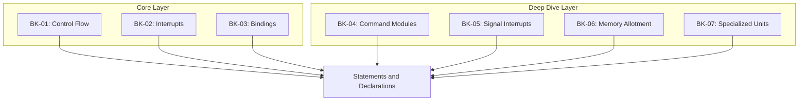

# SR-08: Statements and Declarations (The System Rules)

> **"Bagaimana eksekusi diarahkan, dihentikan, dan diikat ke dalam statement-level rules."**

**Source Hub**:
- [ECMA-262: Statements and Declarations](https://tc39.es/ecma262/#sec-ecmascript-language-statements-and-declarations)

---

## The 7-Book Structural Architecture

---

## Koleksi Buku
1. **[BK-01: Control Flow and Blocks](./BK-01_ControlFlow/)**: blok, lexical scope, selection, dan iteration.
2. **[BK-02: Signal Interrupts and Exceptions](./BK-02_Interrupts/)**: `break`, `continue`, `return`, `throw`, dan `try/catch/finally`.
3. **[BK-03: Variable Bindings and Modules](./BK-03_Bindings/)**: deklarasi `var/let/const`, hoisting, serta hubungan ke script dan module roots.
4. **[BK-04: Command Modules](./BK-04_CommandModules/)**: pendalaman unit seleksi dan iterasi sebagai modul kendali.
5. **[BK-05: Signal Interrupts](./BK-05_SignalInterrupts/)**: pendalaman interrupt lokal, eksternal, dan safety vault.
6. **[BK-06: Memory Allotment](./BK-06_MemoryAllotment/)**: pendalaman block-scoped vs legacy allocation model.
7. **[BK-07: Specialized Units](./BK-07_SpecializedUnits/)**: pendalaman label statements dan diagnostic units.

---

## Catatan Audit Struktur

`SR-08` kini diperlakukan sebagai sub-rak 7 buku:
- `BK-01` sampai `BK-03` adalah jalur inti untuk control flow, interrupts, dan bindings.
- `BK-04` sampai `BK-07` adalah jalur pendalaman yang sebelumnya hidup sebagai struktur paralel dan kini dinormalisasi sebagai buku eksplisit.

---
*Status: [/] Partial | [status.md](../docs/status.md) | Back to [RAK-04](../README.md)*
