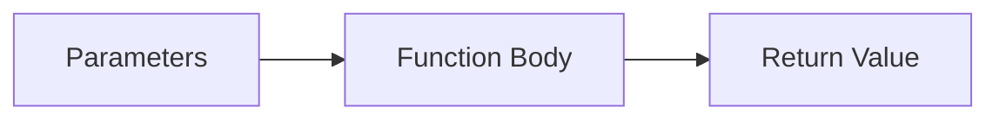

# CH-01: Base Models

> **"Model dasar fungsi biasa sebagai pembangkit kerja utama di Grid."**

**Source Hub**:
- [ECMA-262: Function Definitions](https://tc39.es/ecma262/#sec-function-definitions)

---

## 1. Mental Model: "The Power Plant"

Fungsi biasa adalah unit kerja yang:
- menerima parameter,
- menjalankan body,
- mengirim hasil melalui `return`,
- dapat dideklarasikan sebagai declaration atau expression.

---

## 2. Visualisasi Sistem: Function Processing Core

---

## 3. Mekanisme & Hubungan

1. Function declaration terdaftar saat inisialisasi scope.
2. Function expression baru bisa dipakai setelah binding variabelnya tersedia.
3. Model dasar ini menjadi fondasi bagi seluruh keluarga fungsi lain di `SR-09`.

---

## 4. Lab Praktis

Buka file `examples/01_base_models_lab.js` untuk membandingkan declaration dan expression dalam satu eksperimen sederhana.

---
*Status: [x] Complete | [status.md](../../../docs/status.md)*
