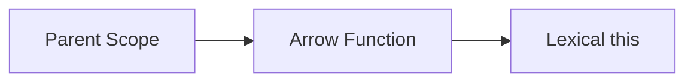

# CH-02: Arrow Units

> **"Fungsi leksikal yang ringan dan sengaja tidak membawa konteksnya sendiri."**

**Source Hub**:
- [ECMA-262: Arrow Function Definitions](https://tc39.es/ecma262/#sec-arrow-function-definitions)

---

## 1. Mental Model: "The Lightweight Signal"

Arrow function adalah unit yang:
- tidak punya `this` sendiri,
- tidak punya `arguments` sendiri,
- tidak punya `prototype`,
- meminjam konteks dari lingkungan leksikal.

---

## 2. Visualisasi Sistem: Lexical This Borrowing

---

## 3. Mekanisme & Hubungan

1. Arrow function cocok untuk callback dan helper ringkas.
2. Ia tidak cocok sebagai pengganti universal metode objek.
3. Perbedaan ini menjelaskan banyak bug `this` yang tampak "aneh" di permukaan.

---

## 4. Lab Praktis

Buka file `examples/01_arrow_units_lab.js` untuk melihat bagaimana arrow function meminjam `this` dari lingkungan induknya.

---
*Status: [x] Complete | [status.md](../../../docs/status.md)*
