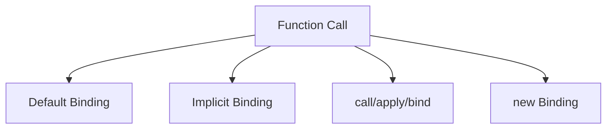

# CH-03: Contextual Energy (`this`)

> **"Pointer dinamis yang berubah berdasarkan bagaimana fungsi dipanggil."**

**Source Hub**:
- [ECMA-262: OrdinaryCallBindThis](https://tc39.es/ecma262/#sec-ordinarycallbindthis)

---

## 1. Mental Model: "The Binding Rules"

Nilai `this` muncul dari mode pemanggilan:
- default binding,
- implicit binding,
- explicit binding,
- `new` binding,
- lexical binding pada arrow function.

---

## 2. Visualisasi Sistem: This Binding Routes

---

## 3. Mekanisme & Hubungan

1. Nilai `this` tidak melekat ke fungsi sekali untuk selamanya.
2. Binding rules menjelaskan mengapa pemanggilan yang tampak mirip bisa menghasilkan target konteks berbeda.
3. Arrow function memotong jalur dinamis ini karena mengambil `this` secara leksikal.

---

## 4. Lab Praktis

Buka file `examples/01_contextual_energy_lab.js` untuk membandingkan implicit, explicit, dan locked binding melalui `bind`.

---
*Status: [x] Complete | [status.md](../../../docs/status.md)*
